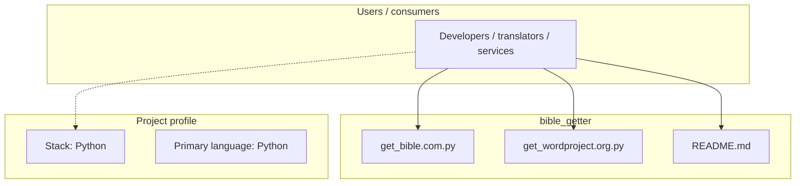
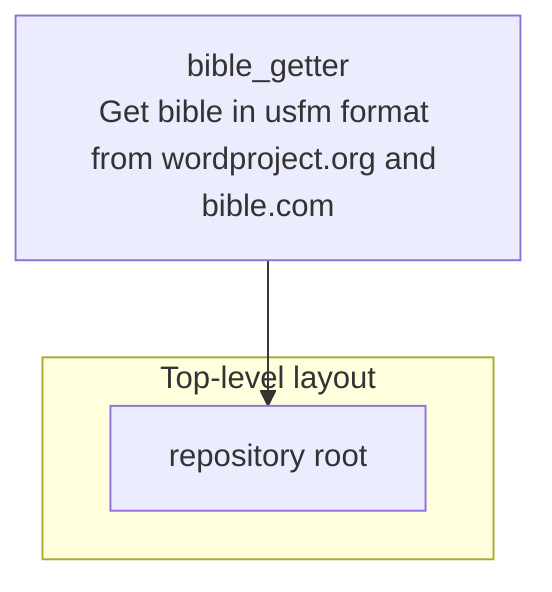

# bible_getter architecture

[WycliffeAssociates/bible_getter](https://github.com/WycliffeAssociates/bible_getter) — Get bible in usfm format from wordproject.org and bible.com.

These scripts help to get bible in usfm format from wordproject.org and bible.com

## System context

## Repository structure

**Notable files:** `get_bible.com.py`, `get_wordproject.org.py`, `README.md`

## Runtime / integration sketch

> This diagram is inferred from repository layout, languages, and README. It is a starting map, not a full design review.

## Languages

| Language | Approx. file count |
|----------|-------------------|
| Python | 2 files |

## Design notes

| Topic | Detail |
|--------|--------|
| **Stack** | Python |
| **Default branch** | `master` |
| **Org** | WycliffeAssociates |

## Related

- Source: [WycliffeAssociates/bible_getter](https://github.com/WycliffeAssociates/bible_getter)
- Branch analyzed: `master`
