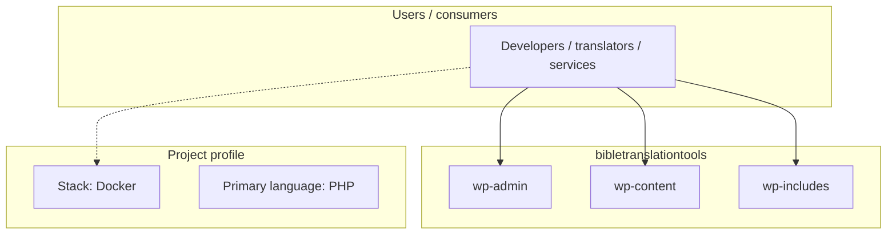
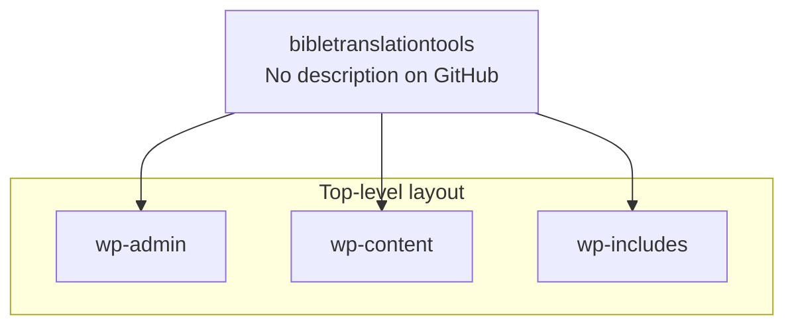

# bibletranslationtools architecture

[WycliffeAssociates/bibletranslationtools](https://github.com/WycliffeAssociates/bibletranslationtools) — _no GitHub description_.

bibletranslationtools is a public repository under WycliffeAssociates.

## System context

## Repository structure

**Directories:** `wp-admin`, `wp-content`, `wp-includes`

**Notable files:** `.gitignore`, `.htaccess`, `android-chrome-192x192.png`, `android-chrome-384x384.png`, `apple-touch-icon-120x120.png`, `apple-touch-icon-152x152.png`, `apple-touch-icon-180x180.png`, `apple-touch-icon-60x60.png`, `apple-touch-icon-76x76.png`, `apple-touch-icon.png`, `article.aspx`, `azuredeploy.json`, `browserconfig.xml`, `docker-compose.yml`, `example.config.php`, `favicon-16x16.png`, `favicon-32x32.png`, `favicon.ico`, `index.php`, `license.txt`

## Runtime / integration sketch

> This diagram is inferred from repository layout, languages, and README. It is a starting map, not a full design review.

## Languages

| Language | Approx. file count |
|----------|-------------------|
| PHP | 2,038 files |
| JavaScript | 763 files |
| CSS | 436 files |
| SCSS | 78 files |
| TypeScript | 53 files |
| HTML | 25 files |
| XML | 2 files |
| YAML | 2 files |

## Design notes

| Topic | Detail |
|--------|--------|
| **Stack** | Docker |
| **Default branch** | `master` |
| **Org** | WycliffeAssociates |

## Related

- Source: [WycliffeAssociates/bibletranslationtools](https://github.com/WycliffeAssociates/bibletranslationtools)
- Branch analyzed: `master`
