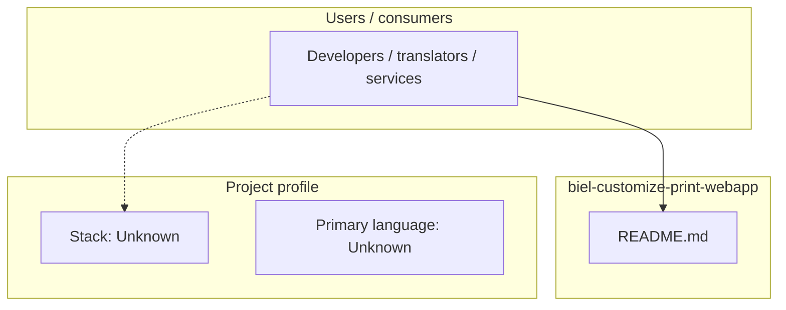
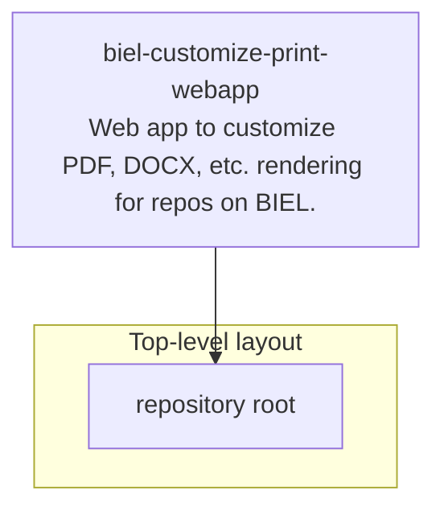

# biel-customize-print-webapp architecture

[WycliffeAssociates/biel-customize-print-webapp](https://github.com/WycliffeAssociates/biel-customize-print-webapp) — Web app to customize PDF, DOCX, etc. rendering for repos on BIEL..

Web app to customize PDF, DOCX, etc. rendering for repos on BIEL.

## System context

## Repository structure

**Notable files:** `README.md`

## Runtime / integration sketch

> This diagram is inferred from repository layout, languages, and README. It is a starting map, not a full design review.

## Languages

| Language | Approx. file count |
|----------|-------------------|
| — | — |

## Design notes

| Topic | Detail |
|--------|--------|
| **Stack** | Unknown |
| **Default branch** | `master` |
| **Org** | WycliffeAssociates |

## Related

- Source: [WycliffeAssociates/biel-customize-print-webapp](https://github.com/WycliffeAssociates/biel-customize-print-webapp)
- Branch analyzed: `master`
