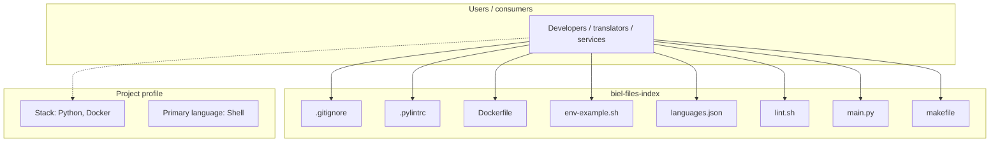
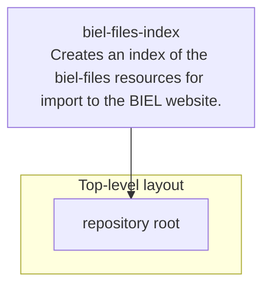
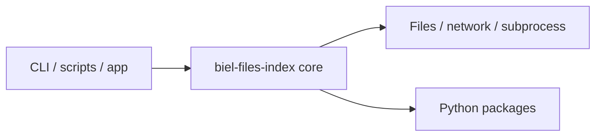

# biel-files-index architecture

[WycliffeAssociates/biel-files-index](https://github.com/WycliffeAssociates/biel-files-index) — Creates an index of the biel-files resources for import to the BIEL website..

biel-files-index ================

## System context

## Repository structure

**Notable files:** `.gitignore`, `.pylintrc`, `Dockerfile`, `env-example.sh`, `languages.json`, `lint.sh`, `main.py`, `makefile`, `README.md`, `requirements.txt`, `test.sh`, `test_main.py`

## Runtime / integration sketch

> This diagram is inferred from repository layout, languages, and README. It is a starting map, not a full design review.

## Languages

| Language | Approx. file count |
|----------|-------------------|
| Shell | 3 files |
| Python | 2 files |

## Design notes

| Topic | Detail |
|--------|--------|
| **Stack** | Python, Docker |
| **Default branch** | `master` |
| **Org** | WycliffeAssociates |

## Related

- Source: [WycliffeAssociates/biel-files-index](https://github.com/WycliffeAssociates/biel-files-index)
- Branch analyzed: `master`
