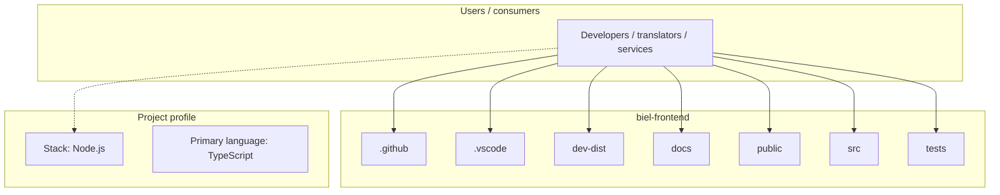
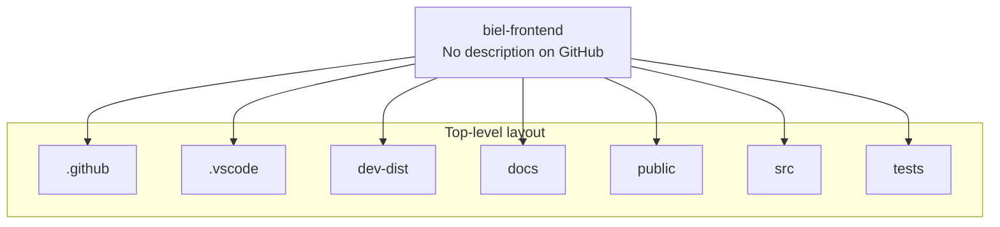
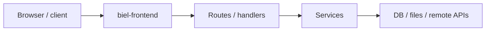

# biel-frontend architecture

[WycliffeAssociates/biel-frontend](https://github.com/WycliffeAssociates/biel-frontend) — _no GitHub description_.

https://evilmartians.com/chronicles/how-to-favicon-in-2021-six-files-that-fit-most-needs?ck_subscriber_id=1931241069

## System context

## Repository structure

**Directories:** `.github`, `.vscode`, `dev-dist`, `docs`, `public`, `src`, `tests`

**Notable files:** `.gitignore`, `.prettierignore`, `astro.config.ts`, `biome.jsonc`, `bun.lock`, `makePageFindIndex.ts`, `manifest.ts`, `package.json`, `playwright.config.ts`, `purge.js`, `README.md`, `tsconfig.json`, `uno.config.ts`, `worker-configuration.d.ts`, `wrangler.jsonc`

## Runtime / integration sketch

> This diagram is inferred from repository layout, languages, and README. It is a starting map, not a full design review.

## Languages

| Language | Approx. file count |
|----------|-------------------|
| TypeScript | 56 files |
| JavaScript | 4 files |
| SCSS | 3 files |
| HTML | 1 files |
| CSS | 1 files |

## Design notes

| Topic | Detail |
|--------|--------|
| **Stack** | Node.js |
| **Default branch** | `prod` |
| **Org** | WycliffeAssociates |

## Related

- Source: [WycliffeAssociates/biel-frontend](https://github.com/WycliffeAssociates/biel-frontend)
- Branch analyzed: `prod`
