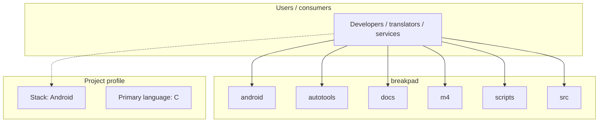
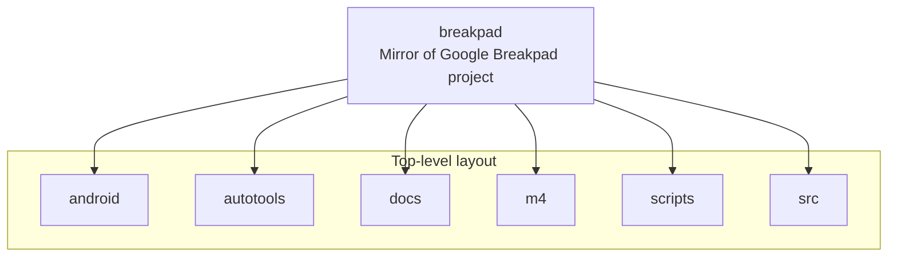

# breakpad architecture

[WycliffeAssociates/breakpad](https://github.com/WycliffeAssociates/breakpad) — Mirror of Google Breakpad project.

Breakpad is a set of client and server components which implement a crash-reporting system.

## System context

## Repository structure

**Directories:** `android`, `autotools`, `docs`, `m4`, `scripts`, `src`

**Notable files:** `.gitignore`, `.travis.yml`, `aclocal.m4`, `appveyor.yml`, `AUTHORS`, `breakpad-client.pc.in`, `breakpad.pc.in`, `ChangeLog`, `codereview.settings`, `configure`, `configure.ac`, `default.xml`, `DEPS`, `INSTALL`, `LICENSE`, `Makefile.am`, `Makefile.in`, `NEWS`, `README.ANDROID`, `README.md`

## Runtime / integration sketch

> This diagram is inferred from repository layout, languages, and README. It is a starting map, not a full design review.

## Languages

| Language | Approx. file count |
|----------|-------------------|
| C | 325 files |
| C++ | 231 files |
| Objective-C | 23 files |
| Shell | 8 files |
| Python | 3 files |
| Go | 2 files |
| YAML | 1 files |
| XML | 1 files |

## Design notes

| Topic | Detail |
|--------|--------|
| **Stack** | Android |
| **Default branch** | `master` |
| **Org** | WycliffeAssociates |

## Related

- Source: [WycliffeAssociates/breakpad](https://github.com/WycliffeAssociates/breakpad)
- Branch analyzed: `master`
