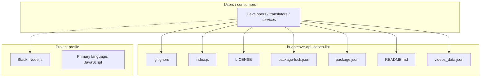
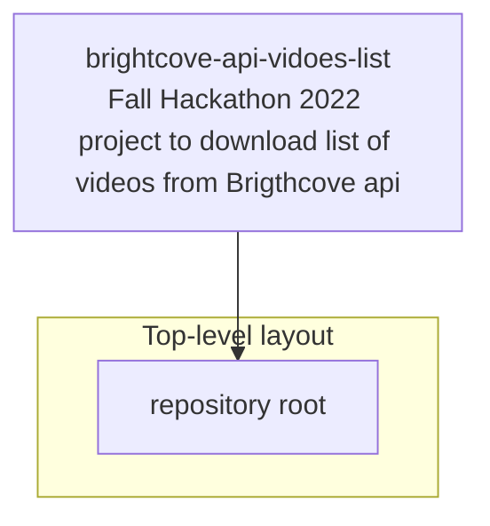
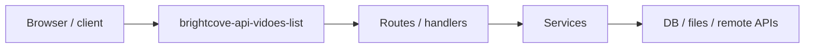

# brightcove-api-vidoes-list architecture

[WycliffeAssociates/brightcove-api-vidoes-list](https://github.com/WycliffeAssociates/brightcove-api-vidoes-list) — Fall Hackathon 2022 project to download list of videos from Brigthcove api.

Fall Hackathon 2022 project to download list of videos from Brigthcove api

## System context

## Repository structure

**Notable files:** `.gitignore`, `index.js`, `LICENSE`, `package-lock.json`, `package.json`, `README.md`, `videos_data.json`

## Runtime / integration sketch

> This diagram is inferred from repository layout, languages, and README. It is a starting map, not a full design review.

## Languages

| Language | Approx. file count |
|----------|-------------------|
| JavaScript | 1 files |

## Design notes

| Topic | Detail |
|--------|--------|
| **Stack** | Node.js |
| **Default branch** | `master` |
| **Org** | WycliffeAssociates |

## Related

- Source: [WycliffeAssociates/brightcove-api-vidoes-list](https://github.com/WycliffeAssociates/brightcove-api-vidoes-list)
- Branch analyzed: `master`
