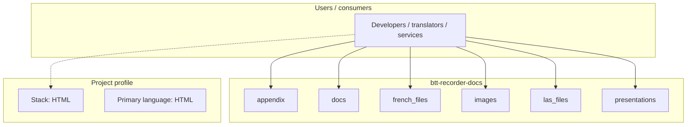
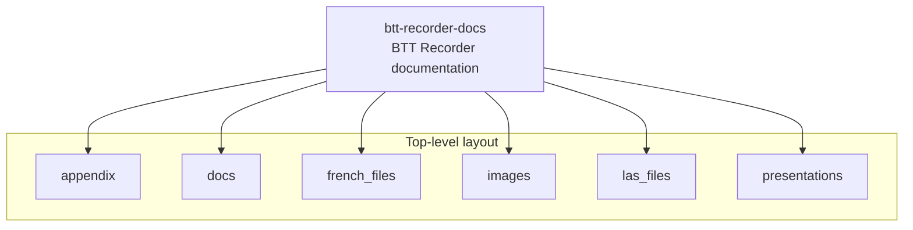
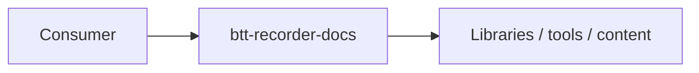

# btt-recorder-docs architecture

[WycliffeAssociates/btt-recorder-docs](https://github.com/WycliffeAssociates/btt-recorder-docs) — BTT Recorder documentation.

See https://btt-recorder.readthedocs.io/en/latest/ for the documentation, this repo is the source files.

## System context

## Repository structure

**Directories:** `appendix`, `docs`, `french_files`, `images`, `las_files`, `presentations`

**Notable files:** `.gitignore`, `.readthedocs.yaml`, `comments.json`, `EditingRecordings_MTT.pdf`, `IconsChecking.pdf`, `LICENSE`, `README.md`, `translationRecorder_How_to_Guide_v0.8.pdf`

## Runtime / integration sketch

> This diagram is inferred from repository layout, languages, and README. It is a starting map, not a full design review.

## Languages

| Language | Approx. file count |
|----------|-------------------|
| HTML | 22 files |
| JavaScript | 14 files |
| CSS | 4 files |
| Python | 1 files |
| Batch | 1 files |

## Design notes

| Topic | Detail |
|--------|--------|
| **Stack** | HTML |
| **Default branch** | `master` |
| **Org** | WycliffeAssociates |

## Related

- Source: [WycliffeAssociates/btt-recorder-docs](https://github.com/WycliffeAssociates/btt-recorder-docs)
- Branch analyzed: `master`
