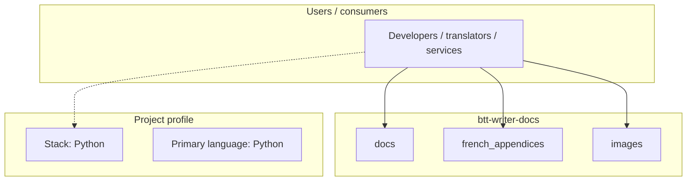
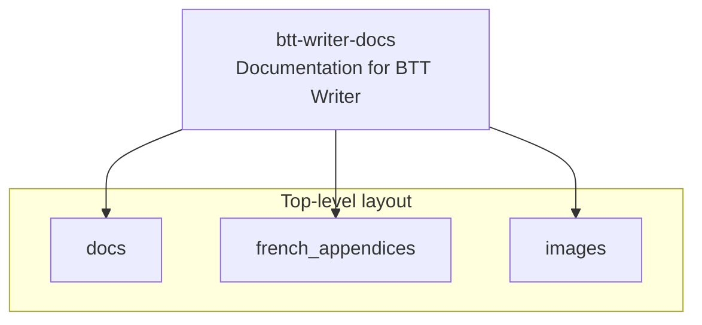
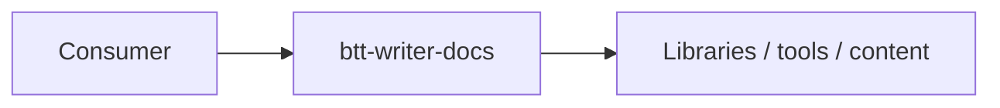

# btt-writer-docs architecture

[WycliffeAssociates/btt-writer-docs](https://github.com/WycliffeAssociates/btt-writer-docs) — Documentation for BTT Writer.

This is a repository for documentation for BTT Writer. See https://btt-writer-docs.readthedocs.io/en/latest/ for the documentation, this repo is the source files.

## System context

## Repository structure

**Directories:** `docs`, `french_appendices`, `images`

**Notable files:** `.readthedocs.yaml`, `DFootnote.pdf`, `DFootnote.pptx`, `LICENSE`, `README.md`, `readme.md`

## Runtime / integration sketch

> This diagram is inferred from repository layout, languages, and README. It is a starting map, not a full design review.

## Languages

| Language | Approx. file count |
|----------|-------------------|
| Python | 2 files |
| Batch | 2 files |

## Design notes

| Topic | Detail |
|--------|--------|
| **Stack** | Python |
| **Default branch** | `master` |
| **Org** | WycliffeAssociates |

## Related

- Source: [WycliffeAssociates/btt-writer-docs](https://github.com/WycliffeAssociates/btt-writer-docs)
- Branch analyzed: `master`
