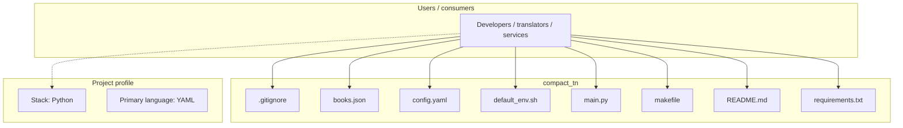
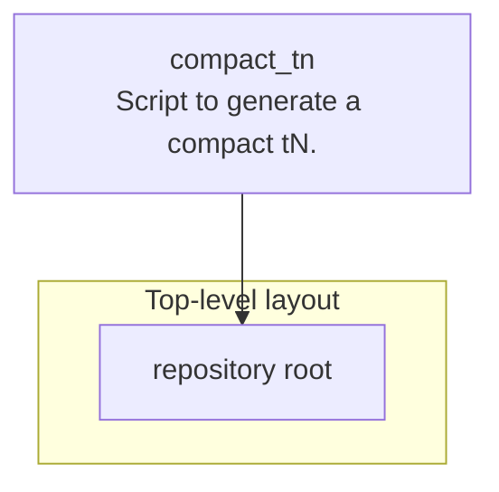
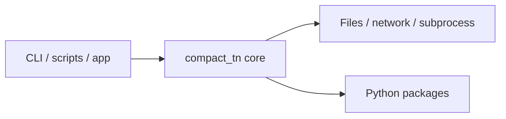

# compact_tn architecture

[WycliffeAssociates/compact_tn](https://github.com/WycliffeAssociates/compact_tn) — Script to generate a compact tN..

1. `git pull` source repo in e.g. .../en_tn_lite 2. `source default_env.sh` to set common env vars 3. Update config.yaml: - Set `tn_dir` to the directory where the tN repo is. - set `book_ids` to contain the books you want to convert, or empty for all books. 4. `make run` 5. This directory should now contain the `*.md.pdf` files.

## System context

## Repository structure

**Notable files:** `.gitignore`, `books.json`, `config.yaml`, `default_env.sh`, `main.py`, `makefile`, `README.md`, `requirements.txt`, `style.css`

## Runtime / integration sketch

> This diagram is inferred from repository layout, languages, and README. It is a starting map, not a full design review.

## Languages

| Language | Approx. file count |
|----------|-------------------|
| YAML | 1 files |
| Shell | 1 files |
| Python | 1 files |
| CSS | 1 files |

## Design notes

| Topic | Detail |
|--------|--------|
| **Stack** | Python |
| **Default branch** | `main` |
| **Org** | WycliffeAssociates |

## Related

- Source: [WycliffeAssociates/compact_tn](https://github.com/WycliffeAssociates/compact_tn)
- Branch analyzed: `main`
