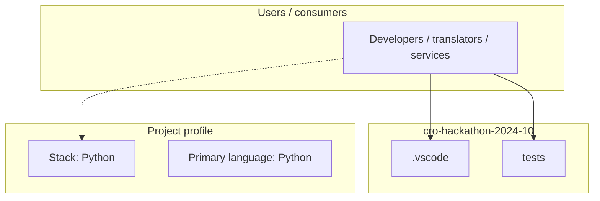
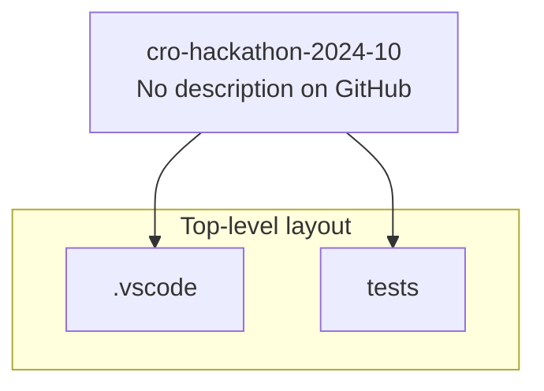
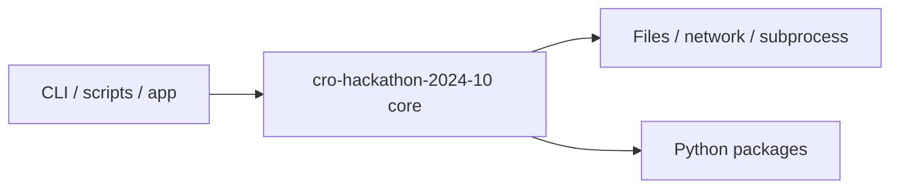

# cro-hackathon-2024-10 architecture

[WycliffeAssociates/cro-hackathon-2024-10](https://github.com/WycliffeAssociates/cro-hackathon-2024-10) — _no GitHub description_.

From WACS, clone a repo that you control to your local storage.

## System context

## Repository structure

**Directories:** `.vscode`, `tests`

**Notable files:** `.coveragerc`, `.gitignore`, `analyzer.py`, `dictionary_table_model.py`, `filter_proxy_model.py`, `icon.png`, `main.py`, `main.spec`, `main_window.py`, `makefile`, `pylintrc`, `readme.md`, `requirements.txt`, `settings.py`, `worker.py`

## Runtime / integration sketch

> This diagram is inferred from repository layout, languages, and README. It is a starting map, not a full design review.

## Languages

| Language | Approx. file count |
|----------|-------------------|
| Python | 9 files |

## Design notes

| Topic | Detail |
|--------|--------|
| **Stack** | Python |
| **Default branch** | `master` |
| **Org** | WycliffeAssociates |

## Related

- Source: [WycliffeAssociates/cro-hackathon-2024-10](https://github.com/WycliffeAssociates/cro-hackathon-2024-10)
- Branch analyzed: `master`
