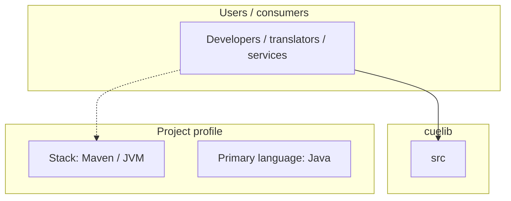
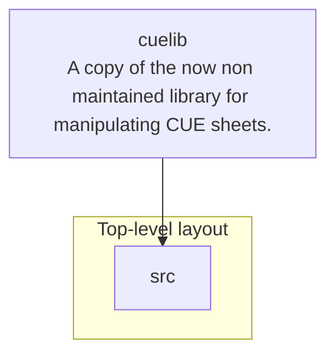

# cuelib architecture

[WycliffeAssociates/cuelib](https://github.com/WycliffeAssociates/cuelib) — A copy of the now non maintained library for manipulating CUE sheets..

A copy of the now non maintained library for manipulating CUE sheets.

## System context

## Repository structure

**Directories:** `src`

**Notable files:** `.gitattributes`, `.gitignore`, `.travis.yml`, `LICENSE.txt`, `pom.xml`

## Runtime / integration sketch

> This diagram is inferred from repository layout, languages, and README. It is a starting map, not a full design review.

## Languages

| Language | Approx. file count |
|----------|-------------------|
| Java | 23 files |
| XML | 1 files |

## Design notes

| Topic | Detail |
|--------|--------|
| **Stack** | Maven / JVM |
| **Default branch** | `master` |
| **Org** | WycliffeAssociates |

## Related

- Source: [WycliffeAssociates/cuelib](https://github.com/WycliffeAssociates/cuelib)
- Branch analyzed: `master`
