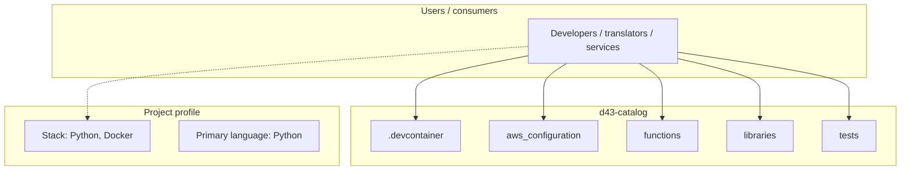
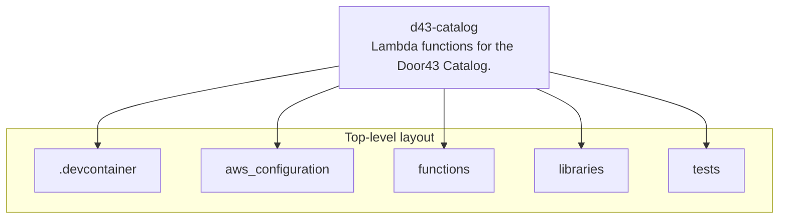
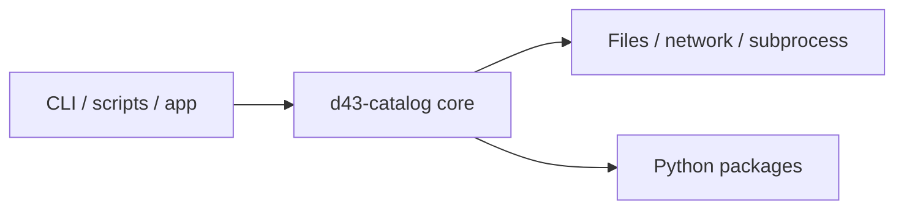

# d43-catalog architecture

[WycliffeAssociates/d43-catalog](https://github.com/WycliffeAssociates/d43-catalog) — Lambda functions for the Door43 Catalog..

master:

## System context

## Repository structure

**Directories:** `.devcontainer`, `aws_configuration`, `functions`, `libraries`, `tests`

**Notable files:** `.coveragerc`, `.gitignore`, `.travis.yml`, `Dockerfile`, `entrypoint-test.sh`, `execute.py`, `install-apex.sh`, `jenkins-wa.sh`, `makefile`, `project.develop.json`, `project.json`, `project.poc.json`, `project.prod.json`, `README.md`, `requirements.txt`, `setup.py`, `test-setup.py`

## Runtime / integration sketch

> This diagram is inferred from repository layout, languages, and README. It is a starting map, not a full design review.

## Languages

| Language | Approx. file count |
|----------|-------------------|
| Python | 97 files |
| YAML | 6 files |
| XML | 5 files |
| Shell | 3 files |
| HTML | 1 files |

## Design notes

| Topic | Detail |
|--------|--------|
| **Stack** | Python, Docker |
| **Default branch** | `develop` |
| **Org** | WycliffeAssociates |

## Related

- Source: [WycliffeAssociates/d43-catalog](https://github.com/WycliffeAssociates/d43-catalog)
- Branch analyzed: `develop`
