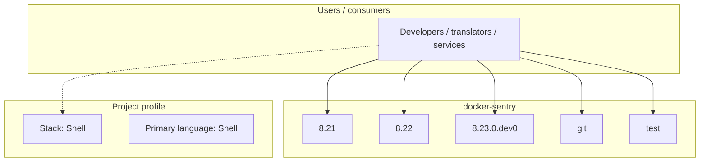
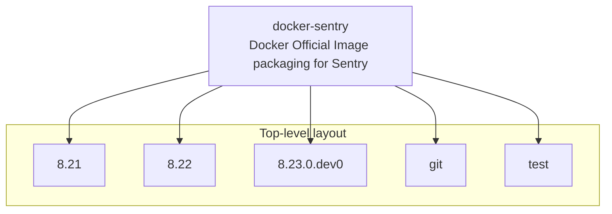
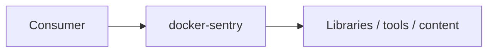

# docker-sentry architecture

[WycliffeAssociates/docker-sentry](https://github.com/WycliffeAssociates/docker-sentry) — Docker Official Image packaging for Sentry.

This is the Git repo of the official Docker image for [sentry](https://registry.hub.docker.com/_/sentry/). See the Hub page for the full readme on how to use the Docker image and for information regarding contributing and issues.

## System context

## Repository structure

**Directories:** `8.21`, `8.22`, `8.23.0.dev0`, `git`, `test`

**Notable files:** `.travis.yml`, `build-git.sh`, `generate-stackbrew-library.sh`, `LICENSE`, `README.md`, `update.sh`

## Runtime / integration sketch

> This diagram is inferred from repository layout, languages, and README. It is a starting map, not a full design review.

## Languages

| Language | Approx. file count |
|----------|-------------------|
| Shell | 8 files |
| YAML | 4 files |
| Python | 4 files |

## Design notes

| Topic | Detail |
|--------|--------|
| **Stack** | Shell |
| **Default branch** | `master` |
| **Org** | WycliffeAssociates |

## Related

- Source: [WycliffeAssociates/docker-sentry](https://github.com/WycliffeAssociates/docker-sentry)
- Branch analyzed: `master`
