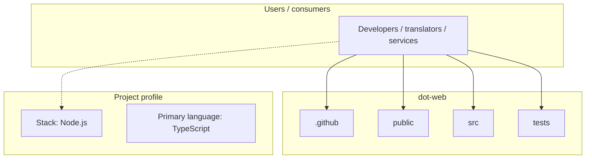
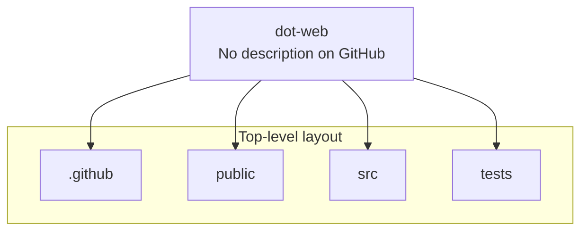
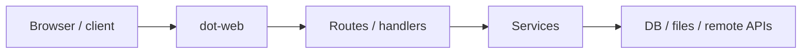

# dot-web architecture

[WycliffeAssociates/dot-web](https://github.com/WycliffeAssociates/dot-web) — _no GitHub description_.

An astro site to consume deaf new testaments.

## System context

## Repository structure

**Directories:** `.github`, `public`, `src`, `tests`

**Notable files:** `.eslintrc.cjs`, `.gitignore`, `AGENTS.md`, `astro.config.mjs`, `package.json`, `playwright.config.ts`, `pnpm-lock.yaml`, `README.md`, `tsconfig.json`, `uno.config.ts`

## Runtime / integration sketch

> This diagram is inferred from repository layout, languages, and README. It is a starting map, not a full design review.

## Languages

| Language | Approx. file count |
|----------|-------------------|
| TypeScript | 40 files |
| YAML | 2 files |
| XML | 1 files |
| CSS | 1 files |

## Design notes

| Topic | Detail |
|--------|--------|
| **Stack** | Node.js |
| **Default branch** | `master` |
| **Org** | WycliffeAssociates |

## Related

- Source: [WycliffeAssociates/dot-web](https://github.com/WycliffeAssociates/dot-web)
- Branch analyzed: `master`
