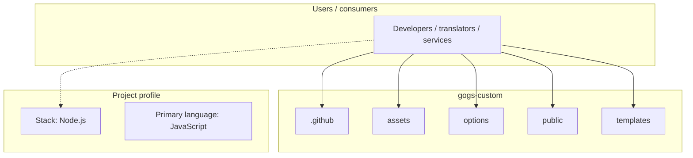
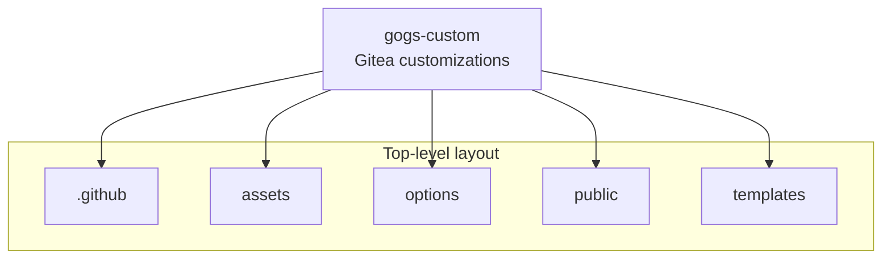
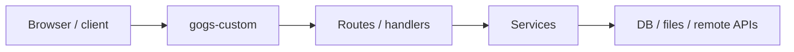

# gogs-custom architecture

[WycliffeAssociates/gogs-custom](https://github.com/WycliffeAssociates/gogs-custom) — Gitea customizations.

This project is UI customizations for WA's Gitea instance. The files here were forked from [Gitea](https://github.com/go-gitea/gitea) and [Gogs](https://gogs.io).

## System context

## Repository structure

**Directories:** `.github`, `assets`, `options`, `public`, `templates`

**Notable files:** `.editorconfig`, `.gitattributes`, `.gitignore`, `DCO`, `LICENSE`, `makecss.sh`, `package.json`, `README.md`

## Runtime / integration sketch

> This diagram is inferred from repository layout, languages, and README. It is a starting map, not a full design review.

## Languages

| Language | Approx. file count |
|----------|-------------------|
| JavaScript | 176 files |
| HTML | 133 files |
| CSS | 16 files |
| Shell | 1 files |
| YAML | 1 files |

## Design notes

| Topic | Detail |
|--------|--------|
| **Stack** | Node.js |
| **Default branch** | `content.bibletranslationtools.org` |
| **Org** | WycliffeAssociates |

## Related

- Source: [WycliffeAssociates/gogs-custom](https://github.com/WycliffeAssociates/gogs-custom)
- Branch analyzed: `content.bibletranslationtools.org`
