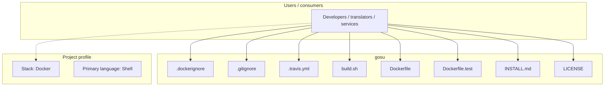
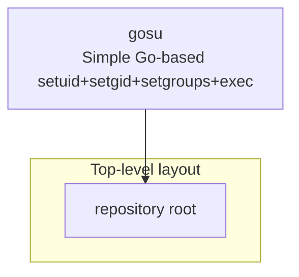

# gosu architecture

[WycliffeAssociates/gosu](https://github.com/WycliffeAssociates/gosu) — Simple Go-based setuid+setgid+setgroups+exec.

This is a simple tool grown out of the simple fact that `su` and `sudo` have very strange and often annoying TTY and signal-forwarding behavior. They're also somewhat complex to setup and use (especially in the case of `sudo`), which allows for a great deal of expressivity, but falls flat if all you need is "run this specific application as this specific user and get out of the pipeline".

## System context

## Repository structure

**Notable files:** `.dockerignore`, `.gitignore`, `.travis.yml`, `build.sh`, `Dockerfile`, `Dockerfile.test`, `INSTALL.md`, `LICENSE`, `main.go`, `README.md`, `setup-user.go`, `sign.sh`, `test.sh`, `version.go`

## Runtime / integration sketch

> This diagram is inferred from repository layout, languages, and README. It is a starting map, not a full design review.

## Languages

| Language | Approx. file count |
|----------|-------------------|
| Shell | 3 files |
| Go | 3 files |

## Design notes

| Topic | Detail |
|--------|--------|
| **Stack** | Docker |
| **Default branch** | `master` |
| **Org** | WycliffeAssociates |

## Related

- Source: [WycliffeAssociates/gosu](https://github.com/WycliffeAssociates/gosu)
- Branch analyzed: `master`
