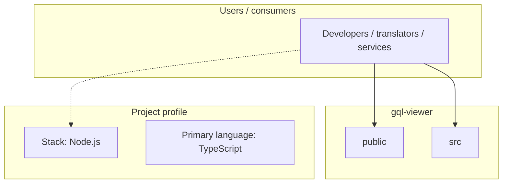
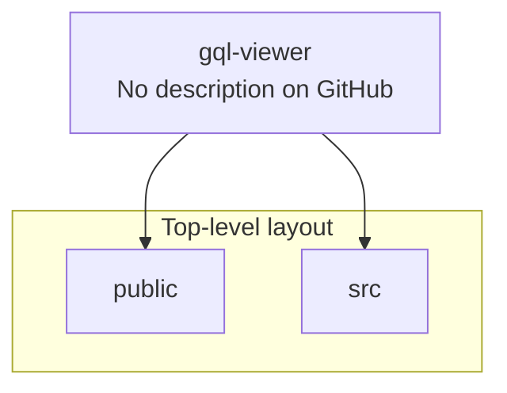
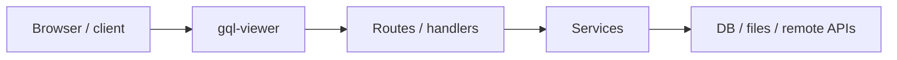

# gql-viewer architecture

[WycliffeAssociates/gql-viewer](https://github.com/WycliffeAssociates/gql-viewer) — _no GitHub description_.

gql-viewer is a public repository under WycliffeAssociates.

## System context

## Repository structure

**Directories:** `public`, `src`

**Notable files:** `.env`, `.gitignore`, `.npmrc`, `package-lock.json`, `package.json`, `tsconfig.json`

## Runtime / integration sketch

> This diagram is inferred from repository layout, languages, and README. It is a starting map, not a full design review.

## Languages

| Language | Approx. file count |
|----------|-------------------|
| TypeScript | 6 files |
| HTML | 1 files |
| CSS | 1 files |

## Design notes

| Topic | Detail |
|--------|--------|
| **Stack** | Node.js |
| **Default branch** | `master` |
| **Org** | WycliffeAssociates |

## Related

- Source: [WycliffeAssociates/gql-viewer](https://github.com/WycliffeAssociates/gql-viewer)
- Branch analyzed: `master`
