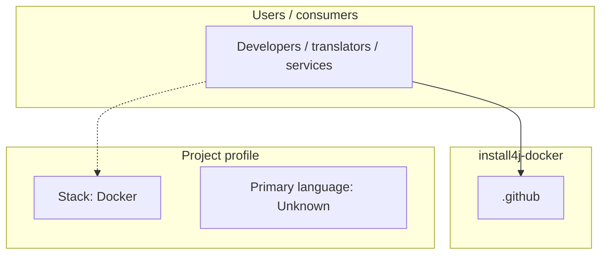
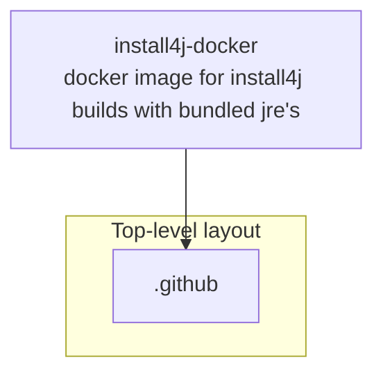

# install4j-docker architecture

[WycliffeAssociates/install4j-docker](https://github.com/WycliffeAssociates/install4j-docker) — docker image for install4j builds with bundled jre's.

docker image for install4j builds with bundled jre's

## System context

## Repository structure

**Directories:** `.github`

**Notable files:** `Dockerfile`, `README.md`

## Runtime / integration sketch

> This diagram is inferred from repository layout, languages, and README. It is a starting map, not a full design review.

## Languages

| Language | Approx. file count |
|----------|-------------------|
| — | — |

## Design notes

| Topic | Detail |
|--------|--------|
| **Stack** | Docker |
| **Default branch** | `default` |
| **Org** | WycliffeAssociates |

## Related

- Source: [WycliffeAssociates/install4j-docker](https://github.com/WycliffeAssociates/install4j-docker)
- Branch analyzed: `default`
