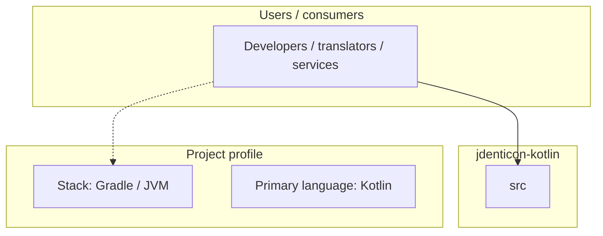
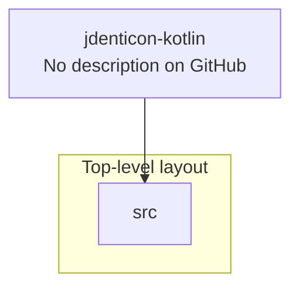
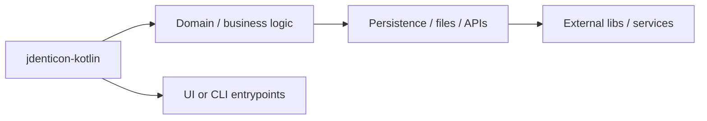

# jdenticon-kotlin architecture

[WycliffeAssociates/jdenticon-kotlin](https://github.com/WycliffeAssociates/jdenticon-kotlin) — _no GitHub description_.

(https://jitpack.io/#WycliffeAssociates/jdenticon-kotlin)

## System context

## Repository structure

**Directories:** `src`

**Notable files:** `.gitattributes`, `.gitignore`, `build.gradle`, `gradlew`, `gradlew.bat`, `README.md`, `settings.gradle`

## Runtime / integration sketch

> This diagram is inferred from repository layout, languages, and README. It is a starting map, not a full design review.

## Languages

| Language | Approx. file count |
|----------|-------------------|
| Kotlin | 19 files |
| Gradle | 2 files |
| Batch | 1 files |

## Design notes

| Topic | Detail |
|--------|--------|
| **Stack** | Gradle / JVM |
| **Default branch** | `master` |
| **Org** | WycliffeAssociates |

## Related

- Source: [WycliffeAssociates/jdenticon-kotlin](https://github.com/WycliffeAssociates/jdenticon-kotlin)
- Branch analyzed: `master`
