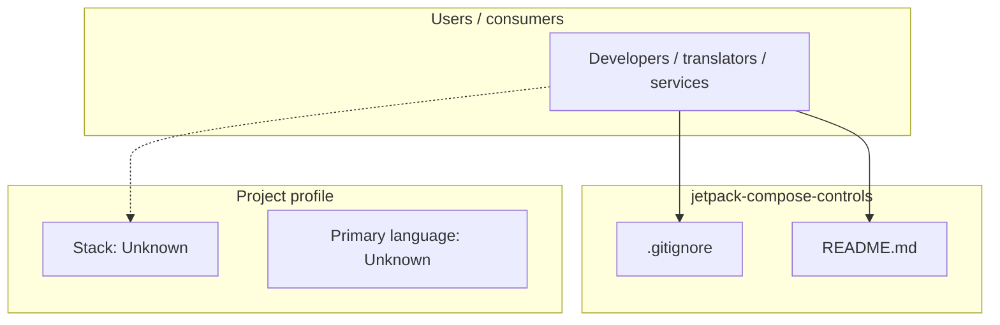
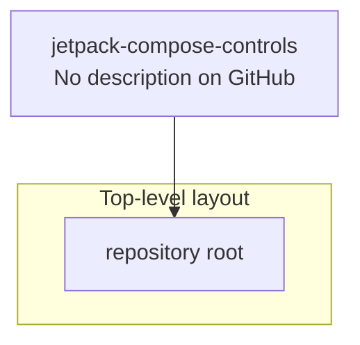
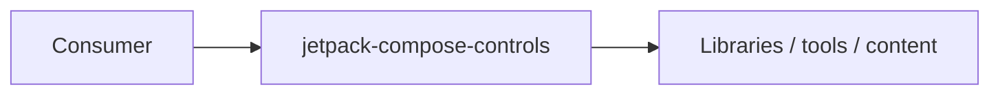

# jetpack-compose-controls architecture

[WycliffeAssociates/jetpack-compose-controls](https://github.com/WycliffeAssociates/jetpack-compose-controls) — _no GitHub description_.

jetpack-compose-controls is a public repository under WycliffeAssociates.

## System context

## Repository structure

**Notable files:** `.gitignore`, `README.md`

## Runtime / integration sketch

> This diagram is inferred from repository layout, languages, and README. It is a starting map, not a full design review.

## Languages

| Language | Approx. file count |
|----------|-------------------|
| — | — |

## Design notes

| Topic | Detail |
|--------|--------|
| **Stack** | Unknown |
| **Default branch** | `default` |
| **Org** | WycliffeAssociates |

## Related

- Source: [WycliffeAssociates/jetpack-compose-controls](https://github.com/WycliffeAssociates/jetpack-compose-controls)
- Branch analyzed: `default`
