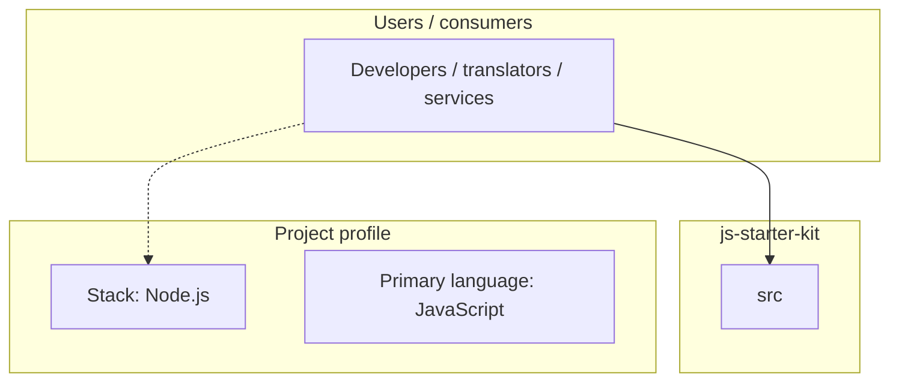
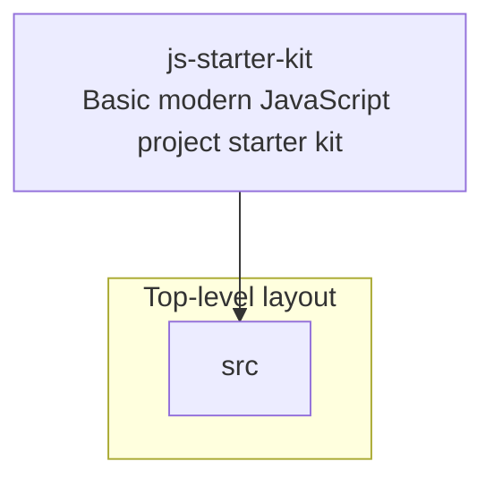
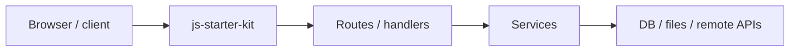

# js-starter-kit architecture

[WycliffeAssociates/js-starter-kit](https://github.com/WycliffeAssociates/js-starter-kit) — Basic modern JavaScript project starter kit.

- Linter/Formatter: [prettier-eslint](https://github.com/prettier/prettier-eslint) - Transpiler: [Babel](https://babeljs.io) - Testing/Coverage: [Jest](https://facebook.github.io/jest/) - Bundler: [Webpack](https://webpack.js.org/)

## System context

## Repository structure

**Directories:** `src`

**Notable files:** `.babelrc`, `.eslintrc.json`, `.gitignore`, `.prettierrc.json`, `package-lock.json`, `package.json`, `README.md`, `webpack.config.js`, `yarn.lock`

## Runtime / integration sketch

> This diagram is inferred from repository layout, languages, and README. It is a starting map, not a full design review.

## Languages

| Language | Approx. file count |
|----------|-------------------|
| JavaScript | 5 files |

## Design notes

| Topic | Detail |
|--------|--------|
| **Stack** | Node.js |
| **Default branch** | `master` |
| **Org** | WycliffeAssociates |

## Related

- Source: [WycliffeAssociates/js-starter-kit](https://github.com/WycliffeAssociates/js-starter-kit)
- Branch analyzed: `master`
