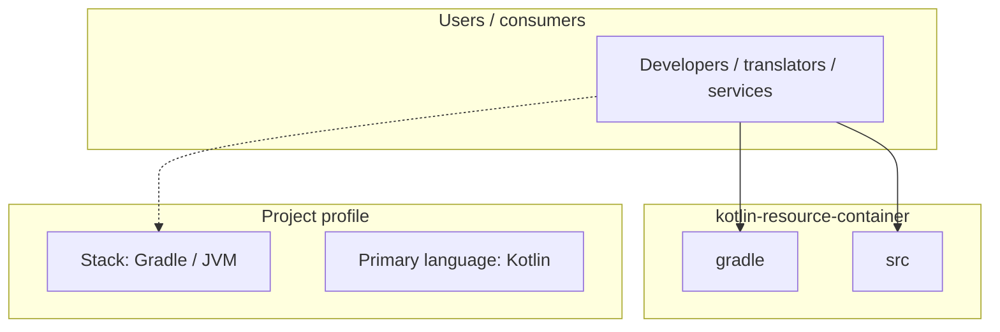
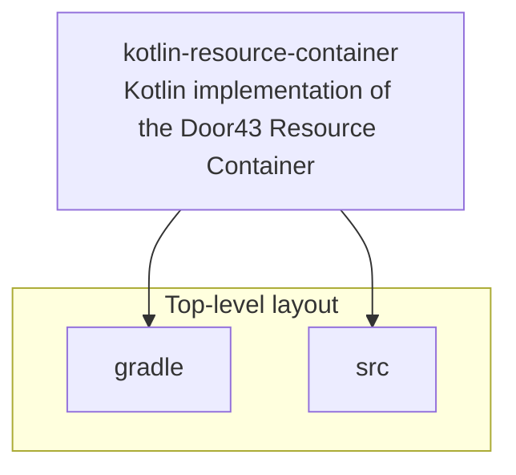
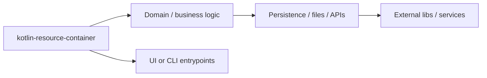

# kotlin-resource-container architecture

[WycliffeAssociates/kotlin-resource-container](https://github.com/WycliffeAssociates/kotlin-resource-container) — Kotlin implementation of the Door43 Resource Container.

This library implements the Door43 Content Services resource container specification for the kotlin language. This library provides kotlin type safe builders for constructing a resource container.

## System context

## Repository structure

**Directories:** `gradle`, `src`

**Notable files:** `.gitattributes`, `.gitignore`, `.travis.yml`, `build.gradle`, `gradlew`, `gradlew.bat`, `LICENSE`, `README.md`, `settings.gradle`

## Runtime / integration sketch

> This diagram is inferred from repository layout, languages, and README. It is a starting map, not a full design review.

## Languages

| Language | Approx. file count |
|----------|-------------------|
| Kotlin | 27 files |
| YAML | 13 files |
| Gradle | 2 files |
| Batch | 1 files |

## Design notes

| Topic | Detail |
|--------|--------|
| **Stack** | Gradle / JVM |
| **Default branch** | `dev` |
| **Org** | WycliffeAssociates |

## Related

- Source: [WycliffeAssociates/kotlin-resource-container](https://github.com/WycliffeAssociates/kotlin-resource-container)
- Branch analyzed: `dev`
