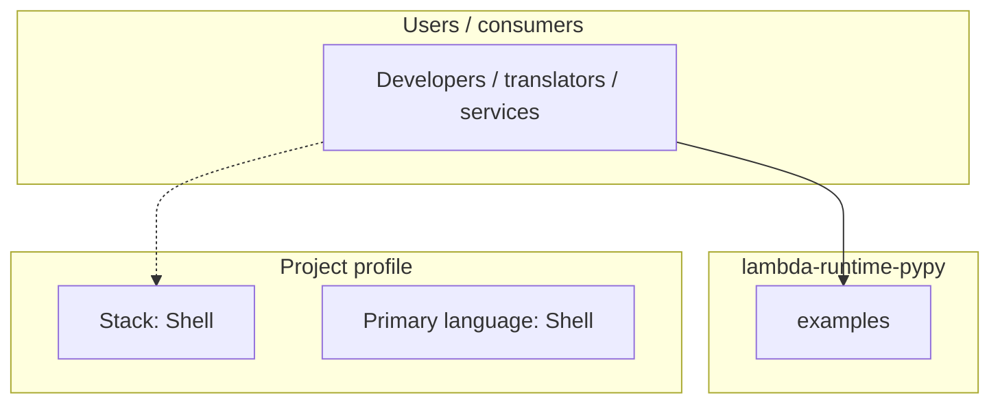
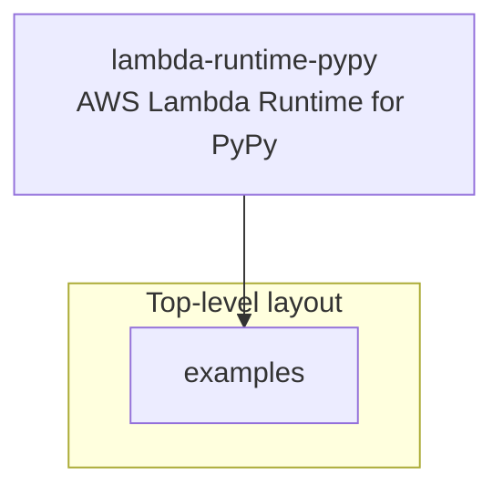
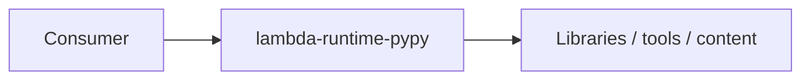

# lambda-runtime-pypy architecture

[WycliffeAssociates/lambda-runtime-pypy](https://github.com/WycliffeAssociates/lambda-runtime-pypy) — AWS Lambda Runtime for PyPy.

An AWS Lambda Runtime for [PyPy](http://pypy.org)

## System context

## Repository structure

**Directories:** `examples`

**Notable files:** `.gitignore`, `bootstrap.py2`, `bootstrap.py3`, `build.sh`, `conf.sh`, `create-buckets.sh`, `latest-layer-arns.sh`, `LICENSE`, `Makefile`, `publish.sh`, `README.md`, `setup.cfg`, `unpublish.sh`, `upload.sh`

## Runtime / integration sketch

> This diagram is inferred from repository layout, languages, and README. It is a starting map, not a full design review.

## Languages

| Language | Approx. file count |
|----------|-------------------|
| Shell | 7 files |
| Python | 2 files |
| YAML | 2 files |

## Design notes

| Topic | Detail |
|--------|--------|
| **Stack** | Shell |
| **Default branch** | `wa-config` |
| **Org** | WycliffeAssociates |

## Related

- Source: [WycliffeAssociates/lambda-runtime-pypy](https://github.com/WycliffeAssociates/lambda-runtime-pypy)
- Branch analyzed: `wa-config`
