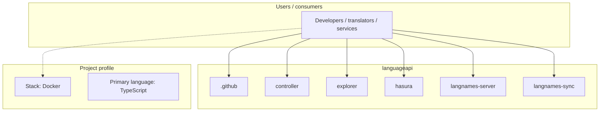
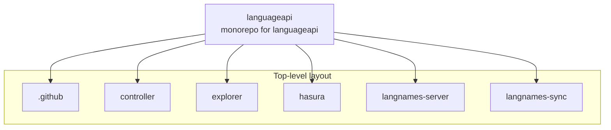
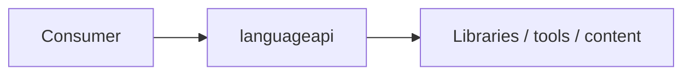

# languageapi architecture

[WycliffeAssociates/languageapi](https://github.com/WycliffeAssociates/languageapi) — monorepo for languageapi.

monorepo for languageapi

## System context

## Repository structure

**Directories:** `.github`, `controller`, `explorer`, `hasura`, `langnames-server`, `langnames-sync`

**Notable files:** `.env`, `.gitignore`, `docker-compose.yml`, `makefile`, `README.md`, `run-dev.sh`

## Runtime / integration sketch

> This diagram is inferred from repository layout, languages, and README. It is a starting map, not a full design review.

## Languages

| Language | Approx. file count |
|----------|-------------------|
| TypeScript | 46 files |
| YAML | 40 files |
| SQL | 35 files |
| CSS | 3 files |
| HTML | 1 files |
| Shell | 1 files |

## Design notes

| Topic | Detail |
|--------|--------|
| **Stack** | Docker |
| **Default branch** | `prod` |
| **Org** | WycliffeAssociates |

## Related

- Source: [WycliffeAssociates/languageapi](https://github.com/WycliffeAssociates/languageapi)
- Branch analyzed: `prod`
