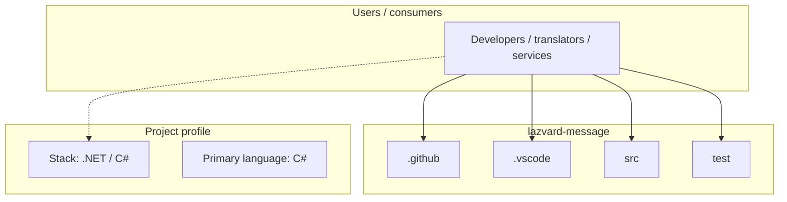
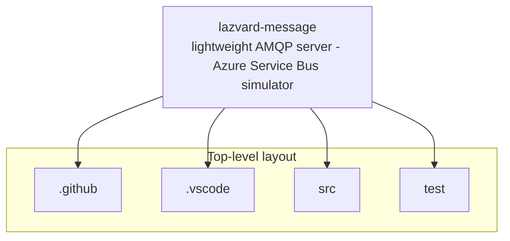
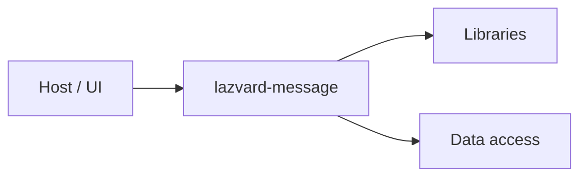

# lazvard-message architecture

[WycliffeAssociates/lazvard-message](https://github.com/WycliffeAssociates/lazvard-message) — lightweight AMQP server - Azure Service Bus simulator.

Lazvard Message is an AMQP server simulator that is **unofficially** compatible with Azure Service Bus.

## System context

## Repository structure

**Directories:** `.github`, `.vscode`, `src`, `test`

**Notable files:** `.editorconfig`, `.gitattributes`, `.gitignore`, `Lazvard.Message.sln`, `LICENSE`, `README.md`

## Runtime / integration sketch

> This diagram is inferred from repository layout, languages, and README. It is a starting map, not a full design review.

## Languages

| Language | Approx. file count |
|----------|-------------------|
| C# | 54 files |
| PowerShell | 1 files |
| Shell | 1 files |

## Design notes

| Topic | Detail |
|--------|--------|
| **Stack** | .NET / C# |
| **Default branch** | `main` |
| **Org** | WycliffeAssociates |

## Related

- Source: [WycliffeAssociates/lazvard-message](https://github.com/WycliffeAssociates/lazvard-message)
- Branch analyzed: `main`
