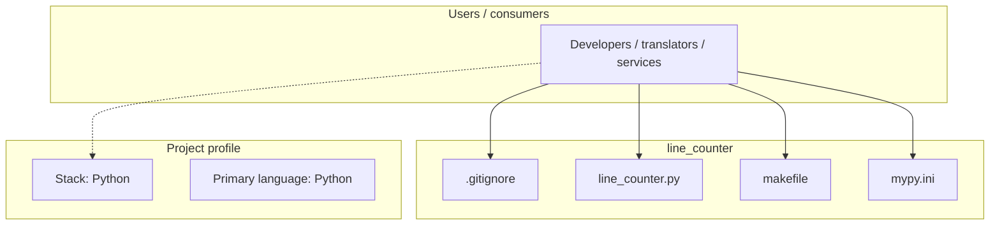
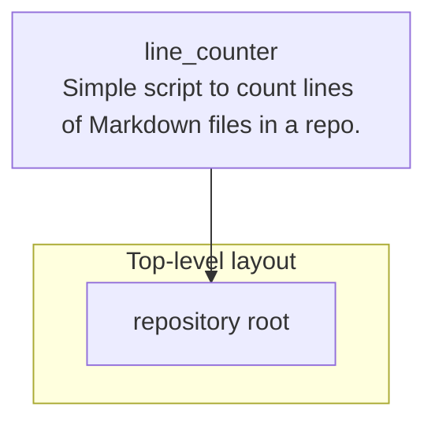

# line_counter architecture

[WycliffeAssociates/line_counter](https://github.com/WycliffeAssociates/line_counter) — Simple script to count lines of Markdown files in a repo..

Simple script to count lines of Markdown files in a repo.

## System context

## Repository structure

**Notable files:** `.gitignore`, `line_counter.py`, `makefile`, `mypy.ini`

## Runtime / integration sketch

> This diagram is inferred from repository layout, languages, and README. It is a starting map, not a full design review.

## Languages

| Language | Approx. file count |
|----------|-------------------|
| Python | 1 files |

## Design notes

| Topic | Detail |
|--------|--------|
| **Stack** | Python |
| **Default branch** | `master` |
| **Org** | WycliffeAssociates |

## Related

- Source: [WycliffeAssociates/line_counter](https://github.com/WycliffeAssociates/line_counter)
- Branch analyzed: `master`
