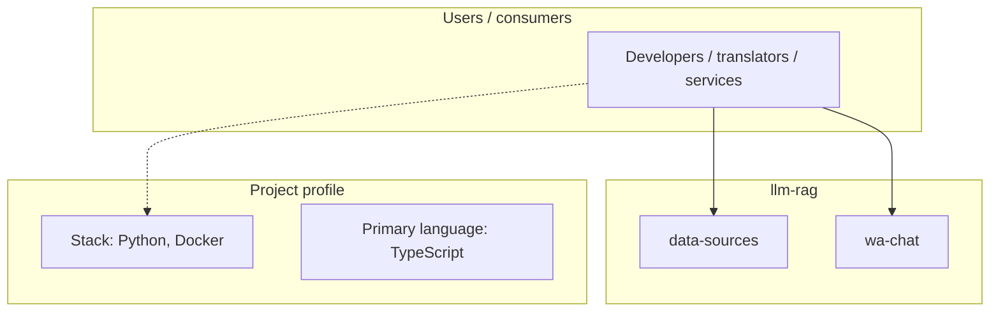
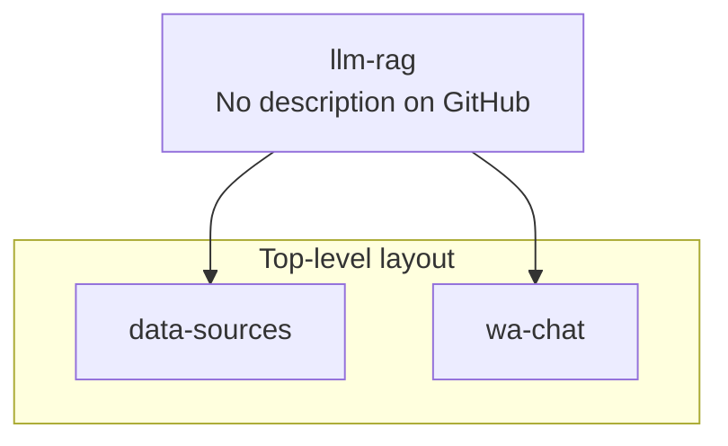
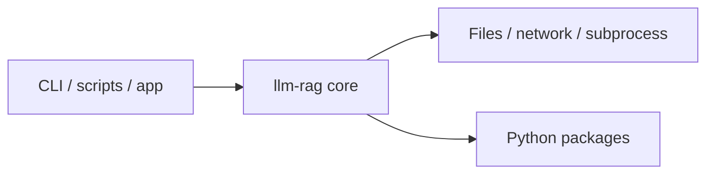

# llm-rag architecture

[WycliffeAssociates/llm-rag](https://github.com/WycliffeAssociates/llm-rag) — _no GitHub description_.

1) python server.py 2) open another terminal 3) cd to wa-chat 4) npm run dev

## System context

## Repository structure

**Directories:** `data-sources`, `wa-chat`

**Notable files:** `.gitignore`, `config.json`, `core.py`, `database.py`, `docker-compose.yml`, `Dockerfile`, `glossary.py`, `init-database.py`, `rag-server.py`, `README.md`, `requirements.txt`, `run.sh`

## Runtime / integration sketch

> This diagram is inferred from repository layout, languages, and README. It is a starting map, not a full design review.

## Languages

| Language | Approx. file count |
|----------|-------------------|
| TypeScript | 9 files |
| Python | 5 files |
| CSS | 2 files |
| YAML | 1 files |
| Shell | 1 files |
| HTML | 1 files |

## Design notes

| Topic | Detail |
|--------|--------|
| **Stack** | Python, Docker |
| **Default branch** | `llm-rag.walink.org` |
| **Org** | WycliffeAssociates |

## Related

- Source: [WycliffeAssociates/llm-rag](https://github.com/WycliffeAssociates/llm-rag)
- Branch analyzed: `llm-rag.walink.org`
