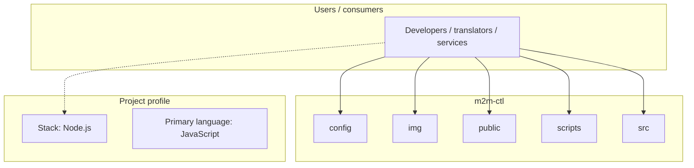
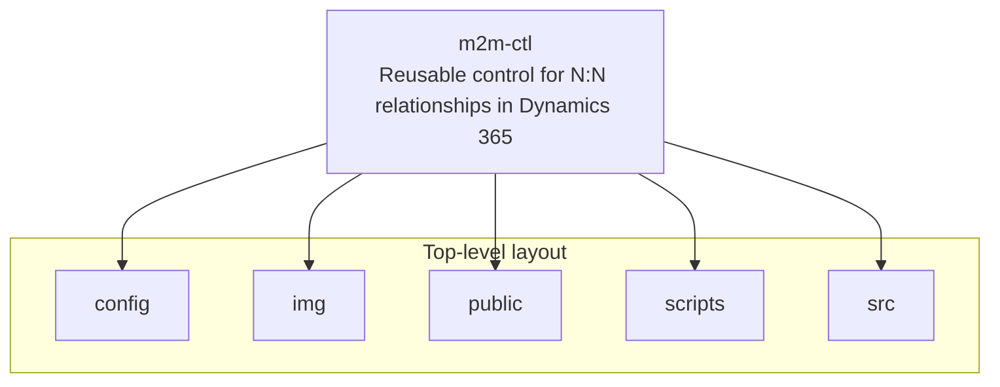
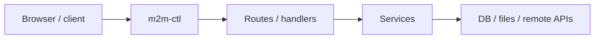

# m2m-ctl architecture

[WycliffeAssociates/m2m-ctl](https://github.com/WycliffeAssociates/m2m-ctl) — Reusable control for N:N relationships in Dynamics 365.

This project was bootstrapped with [Create React App](https://github.com/facebookincubator/create-react-app).

## System context

## Repository structure

**Directories:** `config`, `img`, `public`, `scripts`, `src`

**Notable files:** `.codecov.yml`, `.gitignore`, `.travis.yml`, `package-lock.json`, `package.json`, `README.md`

## Runtime / integration sketch

> This diagram is inferred from repository layout, languages, and README. It is a starting map, not a full design review.

## Languages

| Language | Approx. file count |
|----------|-------------------|
| JavaScript | 60 files |
| HTML | 2 files |
| CSS | 1 files |

## Design notes

| Topic | Detail |
|--------|--------|
| **Stack** | Node.js |
| **Default branch** | `master` |
| **Org** | WycliffeAssociates |

## Related

- Source: [WycliffeAssociates/m2m-ctl](https://github.com/WycliffeAssociates/m2m-ctl)
- Branch analyzed: `master`
