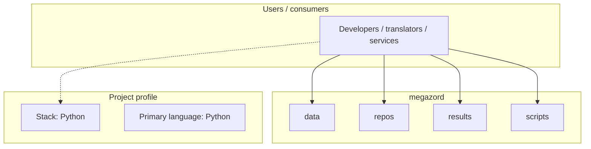
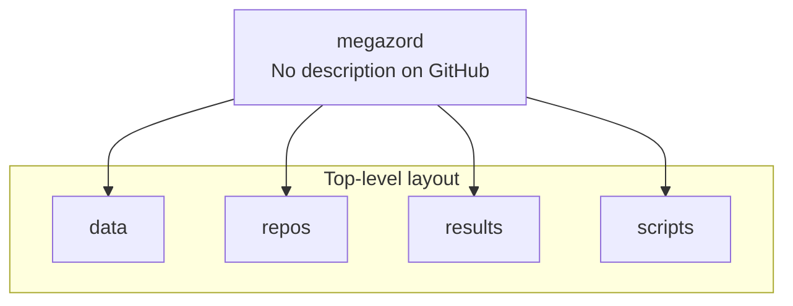

# megazord architecture

[WycliffeAssociates/megazord](https://github.com/WycliffeAssociates/megazord) — _no GitHub description_.

megazord is a public repository under WycliffeAssociates.

## System context

## Repository structure

**Directories:** `data`, `repos`, `results`, `scripts`

**Notable files:** `data.json`

## Runtime / integration sketch

> This diagram is inferred from repository layout, languages, and README. It is a starting map, not a full design review.

## Languages

| Language | Approx. file count |
|----------|-------------------|
| Python | 4 files |
| YAML | 1 files |

## Design notes

| Topic | Detail |
|--------|--------|
| **Stack** | Python |
| **Default branch** | `master` |
| **Org** | WycliffeAssociates |

## Related

- Source: [WycliffeAssociates/megazord](https://github.com/WycliffeAssociates/megazord)
- Branch analyzed: `master`
