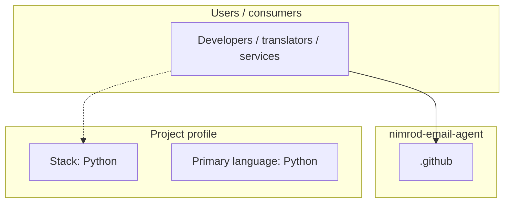
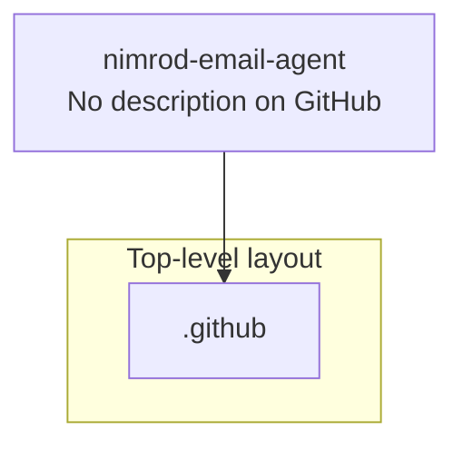
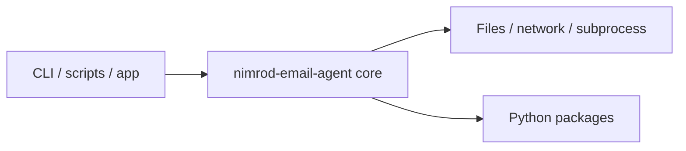

# nimrod-email-agent architecture

[WycliffeAssociates/nimrod-email-agent](https://github.com/WycliffeAssociates/nimrod-email-agent) — _no GitHub description_.

nimrod-email-agent is a public repository under WycliffeAssociates.

## System context

## Repository structure

**Directories:** `.github`

**Notable files:** `.gitignore`, `nimrod-email.py`, `requirements.txt`

## Runtime / integration sketch

> This diagram is inferred from repository layout, languages, and README. It is a starting map, not a full design review.

## Languages

| Language | Approx. file count |
|----------|-------------------|
| Python | 1 files |

## Design notes

| Topic | Detail |
|--------|--------|
| **Stack** | Python |
| **Default branch** | `master` |
| **Org** | WycliffeAssociates |

## Related

- Source: [WycliffeAssociates/nimrod-email-agent](https://github.com/WycliffeAssociates/nimrod-email-agent)
- Branch analyzed: `master`
