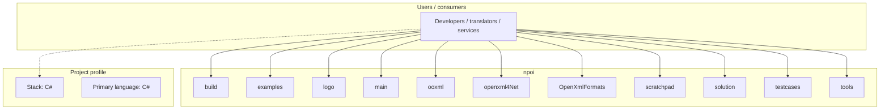
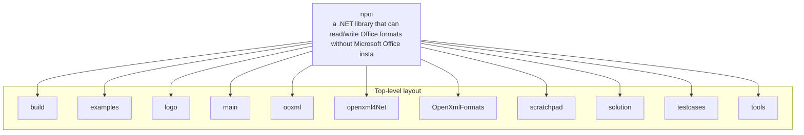

# npoi architecture

[WycliffeAssociates/npoi](https://github.com/WycliffeAssociates/npoi) — a .NET library that can read/write Office formats without Microsoft Office installed. No COM+, no interop..

NPOI =================== This project is the .NET version of POI Java project. With NPOI, you can read/write Office 2003/2007 files very easily. 

## System context

## Repository structure

**Directories:** `build`, `examples`, `logo`, `main`, `ooxml`, `openxml4Net`, `OpenXmlFormats`, `scratchpad`, `solution`, `testcases`, `tools`

**Notable files:** `.gitattributes`, `.gitignore`, `.tgitconfig`, `.travis.yml`, `LICENSE`, `Read Me.txt`, `README.md`, `Release Notes.txt`

## Runtime / integration sketch

> This diagram is inferred from repository layout, languages, and README. It is a starting map, not a full design review.

## Languages

| Language | Approx. file count |
|----------|-------------------|
| C# | 2,793 files |
| PowerShell | 3 files |
| XML | 3 files |
| Batch | 2 files |

## Design notes

| Topic | Detail |
|--------|--------|
| **Stack** | C# |
| **Default branch** | `master` |
| **Org** | WycliffeAssociates |

## Related

- Source: [WycliffeAssociates/npoi](https://github.com/WycliffeAssociates/npoi)
- Branch analyzed: `master`
