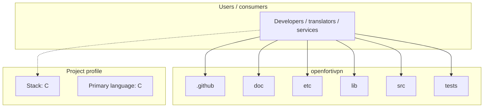
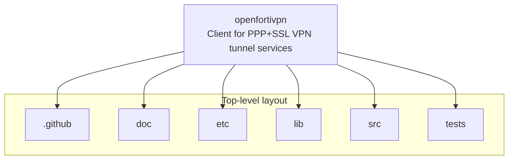
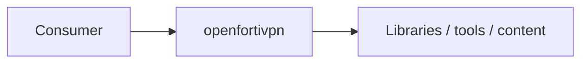

# openfortivpn architecture

[WycliffeAssociates/openfortivpn](https://github.com/WycliffeAssociates/openfortivpn) — Client for PPP+SSL VPN tunnel services.

openfortivpn ============

## System context

## Repository structure

**Directories:** `.github`, `doc`, `etc`, `lib`, `src`, `tests`

**Notable files:** `.gitignore`, `autogen.sh`, `CHANGELOG.md`, `configure.ac`, `LICENSE`, `LICENSE.OpenSSL`, `Makefile.am`, `README.md`

## Runtime / integration sketch

> This diagram is inferred from repository layout, languages, and README. It is a starting map, not a full design review.

## Languages

| Language | Approx. file count |
|----------|-------------------|
| C | 22 files |
| Shell | 6 files |
| Python | 1 files |

## Design notes

| Topic | Detail |
|--------|--------|
| **Stack** | C |
| **Default branch** | `master` |
| **Org** | WycliffeAssociates |

## Related

- Source: [WycliffeAssociates/openfortivpn](https://github.com/WycliffeAssociates/openfortivpn)
- Branch analyzed: `master`
