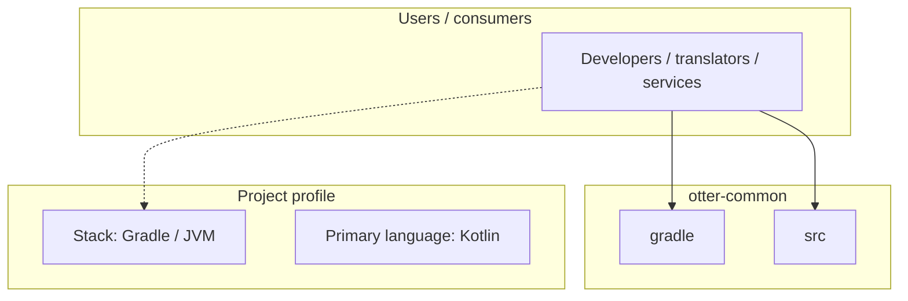
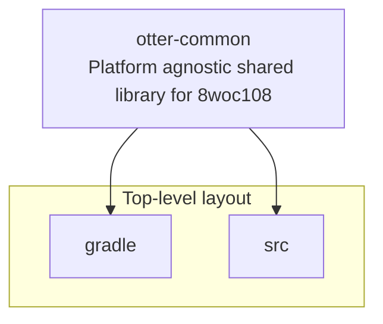
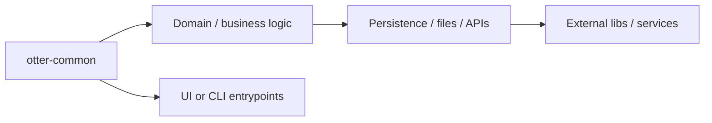

# otter-common architecture

[WycliffeAssociates/otter-common](https://github.com/WycliffeAssociates/otter-common) — Platform agnostic shared library for 8woc108.

Platform agnostic shared library for 8woc108

## System context

## Repository structure

**Directories:** `gradle`, `src`

**Notable files:** `.gitattributes`, `.gitignore`, `.sonarcloud.properties`, `.travis.yml`, `build.gradle`, `gradlew`, `gradlew.bat`, `LICENSE`, `README.md`, `settings.gradle`

## Runtime / integration sketch

> This diagram is inferred from repository layout, languages, and README. It is a starting map, not a full design review.

## Languages

| Language | Approx. file count |
|----------|-------------------|
| Kotlin | 92 files |
| YAML | 4 files |
| Gradle | 2 files |
| Batch | 1 files |

## Design notes

| Topic | Detail |
|--------|--------|
| **Stack** | Gradle / JVM |
| **Default branch** | `dev` |
| **Org** | WycliffeAssociates |

## Related

- Source: [WycliffeAssociates/otter-common](https://github.com/WycliffeAssociates/otter-common)
- Branch analyzed: `dev`
