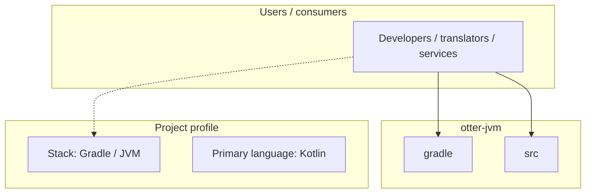
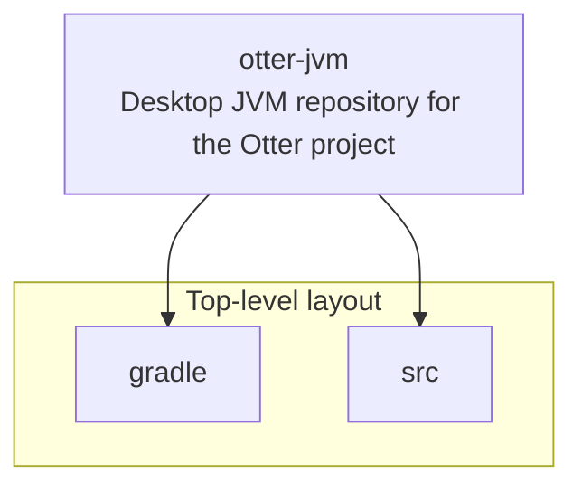
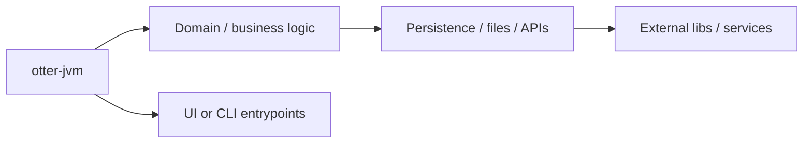

# otter-jvm architecture

[WycliffeAssociates/otter-jvm](https://github.com/WycliffeAssociates/otter-jvm) — Desktop JVM repository for the Otter project.

JVM specific packages for the otter project Supports Windows, MacOs, Linux, and any other operating system that supports the desktop JVM

## System context

## Repository structure

**Directories:** `gradle`, `src`

**Notable files:** `.gitattributes`, `.gitignore`, `.sonarcloud.properties`, `.travis.yml`, `build.gradle`, `gradlew`, `gradlew.bat`, `init_common.sh`, `LICENSE`, `otter.install4j`, `otter.png`, `README.md`, `settings.gradle`

## Runtime / integration sketch

> This diagram is inferred from repository layout, languages, and README. It is a starting map, not a full design review.

## Languages

| Language | Approx. file count |
|----------|-------------------|
| Kotlin | 200 files |
| YAML | 3 files |
| Gradle | 2 files |
| Batch | 1 files |
| Shell | 1 files |
| CSS | 1 files |
| SQL | 1 files |

## Design notes

| Topic | Detail |
|--------|--------|
| **Stack** | Gradle / JVM |
| **Default branch** | `dev` |
| **Org** | WycliffeAssociates |

## Related

- Source: [WycliffeAssociates/otter-jvm](https://github.com/WycliffeAssociates/otter-jvm)
- Branch analyzed: `dev`
