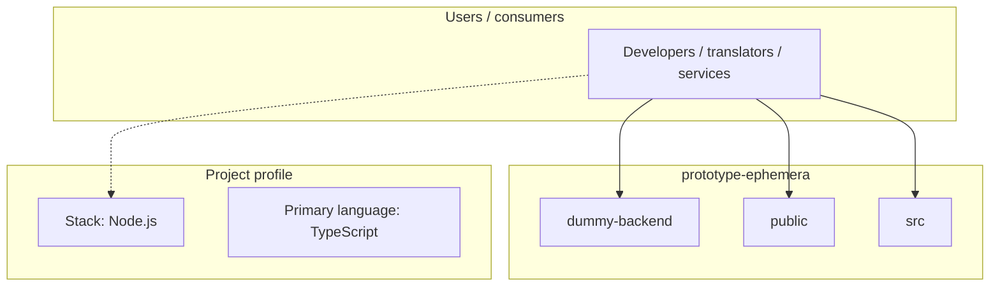
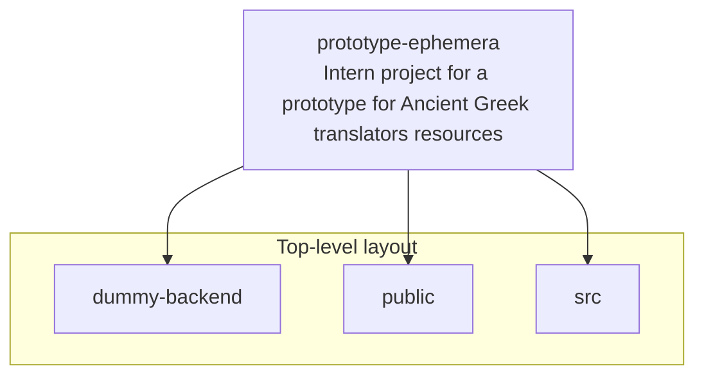
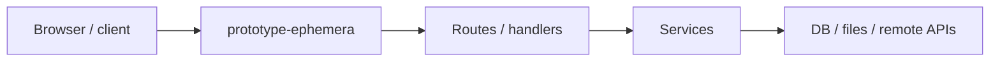

# prototype-ephemera architecture

[WycliffeAssociates/prototype-ephemera](https://github.com/WycliffeAssociates/prototype-ephemera) — Intern project for a prototype for Ancient Greek translators resources.

Intern project for a prototype for Ancient Greek translators resources

## System context

## Repository structure

**Directories:** `dummy-backend`, `public`, `src`

**Notable files:** `.gitignore`, `biome.json`, `index.html`, `jest.config.cjs`, `LICENSE`, `package-lock.json`, `package.json`, `proskomma.d.ts`, `README.md`, `tsconfig.json`, `vite-env.d.ts`, `vite.config.ts`

## Runtime / integration sketch

> This diagram is inferred from repository layout, languages, and README. It is a starting map, not a full design review.

## Languages

| Language | Approx. file count |
|----------|-------------------|
| TypeScript | 76 files |
| JavaScript | 4 files |
| CSS | 2 files |
| HTML | 1 files |

## Design notes

| Topic | Detail |
|--------|--------|
| **Stack** | Node.js |
| **Default branch** | `gwt.bibleineverylanguage.org` |
| **Org** | WycliffeAssociates |

## Related

- Source: [WycliffeAssociates/prototype-ephemera](https://github.com/WycliffeAssociates/prototype-ephemera)
- Branch analyzed: `gwt.bibleineverylanguage.org`
