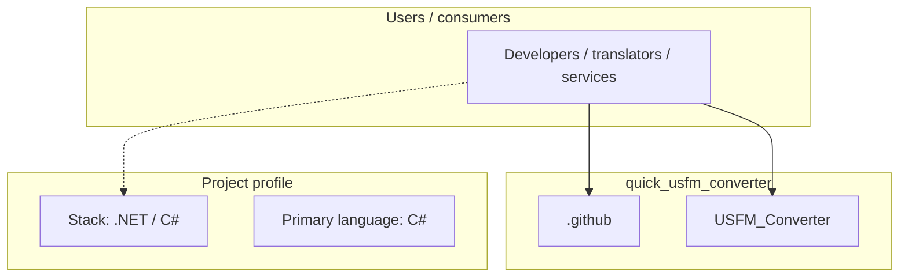
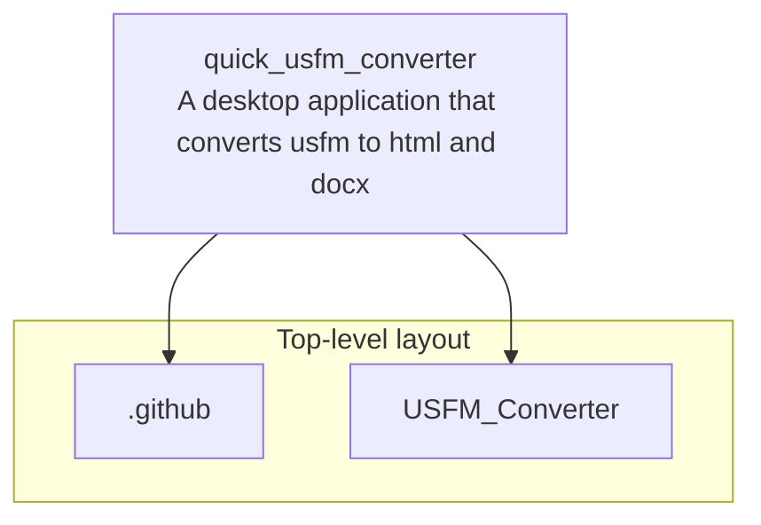
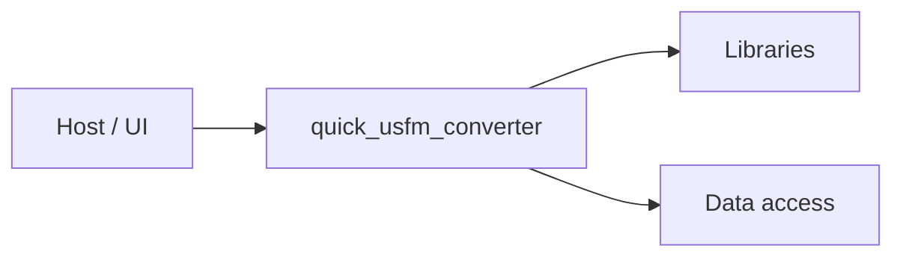

# quick_usfm_converter architecture

[WycliffeAssociates/quick_usfm_converter](https://github.com/WycliffeAssociates/quick_usfm_converter) — A desktop application that converts usfm to html and docx.

Deprecated in favor of https://github.com/Bible-Translation-Tools/USFM-Converter

## System context

## Repository structure

**Directories:** `.github`, `USFM_Converter`

**Notable files:** `.gitignore`, `appveyor.yml`, `installerscript.iss`, `readme.md`, `release.sh`, `USFM_Converter.sln`

## Runtime / integration sketch

> This diagram is inferred from repository layout, languages, and README. It is a starting map, not a full design review.

## Languages

| Language | Approx. file count |
|----------|-------------------|
| C# | 7 files |
| HTML | 1 files |
| CSS | 1 files |
| YAML | 1 files |
| Shell | 1 files |

## Design notes

| Topic | Detail |
|--------|--------|
| **Stack** | .NET / C# |
| **Default branch** | `master` |
| **Org** | WycliffeAssociates |

## Related

- Source: [WycliffeAssociates/quick_usfm_converter](https://github.com/WycliffeAssociates/quick_usfm_converter)
- Branch analyzed: `master`
