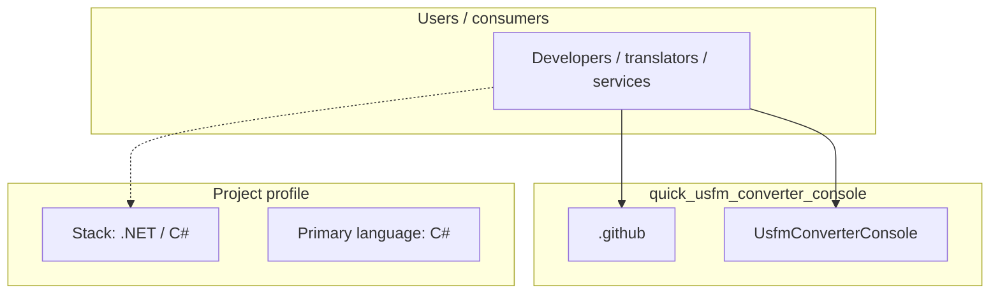
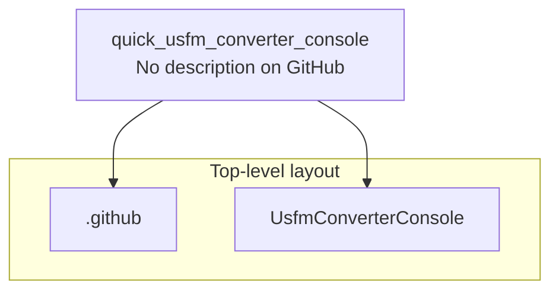
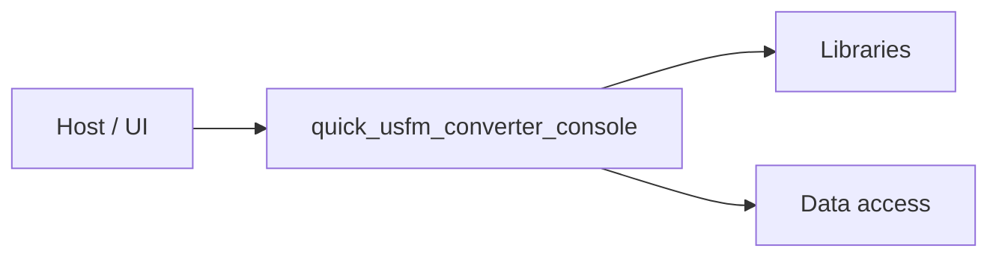

# quick_usfm_converter_console architecture

[WycliffeAssociates/quick_usfm_converter_console](https://github.com/WycliffeAssociates/quick_usfm_converter_console) — _no GitHub description_.

Converts USFM formated files into HTML files. > Can be editted in the Microsoft Word or Libre Office text editors

## System context

## Repository structure

**Directories:** `.github`, `UsfmConverterConsole`

**Notable files:** `.gitignore`, `installerscript.iss`, `readme.md`, `release.sh`, `UsfmConverterConsole.sln`

## Runtime / integration sketch

> This diagram is inferred from repository layout, languages, and README. It is a starting map, not a full design review.

## Languages

| Language | Approx. file count |
|----------|-------------------|
| C# | 3 files |
| HTML | 1 files |
| CSS | 1 files |
| Shell | 1 files |

## Design notes

| Topic | Detail |
|--------|--------|
| **Stack** | .NET / C# |
| **Default branch** | `master` |
| **Org** | WycliffeAssociates |

## Related

- Source: [WycliffeAssociates/quick_usfm_converter_console](https://github.com/WycliffeAssociates/quick_usfm_converter_console)
- Branch analyzed: `master`
