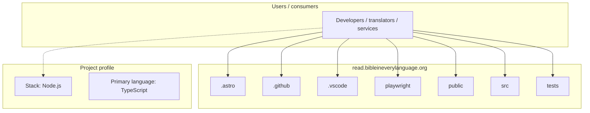
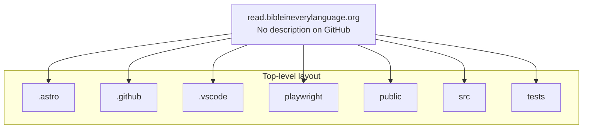

# read.bibleineverylanguage.org architecture

[WycliffeAssociates/read.bibleineverylanguage.org](https://github.com/WycliffeAssociates/read.bibleineverylanguage.org) — _no GitHub description_.

File/Folder tree below:

## System context

## Repository structure

**Directories:** `.astro`, `.github`, `.vscode`, `playwright`, `public`, `src`, `tests`

**Notable files:** `.dev.vars`, `.eslintrc.cjs`, `.gitignore`, `.npmrc`, `astro.config.ts`, `biome.jsonc`, `changelog.md`, `manifest.ts`, `package.json`, `playwright-ct.config.ts`, `playwright.config.ts`, `pnpm-lock.yaml`, `prettier.config.js`, `README.md`, `stats.html`, `tailwind.config.cjs`, `tsconfig.json`, `vitest.config.ts`

## Runtime / integration sketch

> This diagram is inferred from repository layout, languages, and README. It is a starting map, not a full design review.

## Languages

| Language | Approx. file count |
|----------|-------------------|
| TypeScript | 53 files |
| JavaScript | 3 files |
| HTML | 2 files |
| YAML | 1 files |
| CSS | 1 files |

## Design notes

| Topic | Detail |
|--------|--------|
| **Stack** | Node.js |
| **Default branch** | `read-prod` |
| **Org** | WycliffeAssociates |

## Related

- Source: [WycliffeAssociates/read.bibleineverylanguage.org](https://github.com/WycliffeAssociates/read.bibleineverylanguage.org)
- Branch analyzed: `read-prod`
