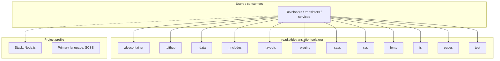
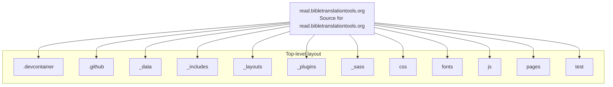
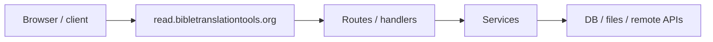

# read.bibletranslationtools.org architecture

[WycliffeAssociates/read.bibletranslationtools.org](https://github.com/WycliffeAssociates/read.bibletranslationtools.org) — Source for read.bibletranslationtools.org.

develop |  -->

## System context

## Repository structure

**Directories:** `.devcontainer`, `.github`, `_data`, `_includes`, `_layouts`, `_plugins`, `_sass`, `css`, `fonts`, `js`, `pages`, `test`

**Notable files:** `.gitignore`, `.travis.yml`, `404.md`, `_config.yml`, `_redirects.yml`, `build.sh`, `Gemfile`, `Gemfile.lock`, `karma.conf.intellij.js`, `karma.conf.js`, `karma_start.sh`, `karma_start_debug.sh`, `karma_stop.sh`, `LICENSE.md`, `package-lock.json`, `package.json`, `README.md`, `run_karma_tests.sh`, `temp-data.json`

## Runtime / integration sketch

> This diagram is inferred from repository layout, languages, and README. It is a starting map, not a full design review.

## Languages

| Language | Approx. file count |
|----------|-------------------|
| SCSS | 93 files |
| JavaScript | 43 files |
| HTML | 19 files |
| YAML | 9 files |
| CSS | 8 files |
| TypeScript | 6 files |
| Shell | 5 files |
| Ruby | 4 files |

## Design notes

| Topic | Detail |
|--------|--------|
| **Stack** | Node.js |
| **Default branch** | `develop` |
| **Org** | WycliffeAssociates |

## Related

- Source: [WycliffeAssociates/read.bibletranslationtools.org](https://github.com/WycliffeAssociates/read.bibletranslationtools.org)
- Branch analyzed: `develop`
