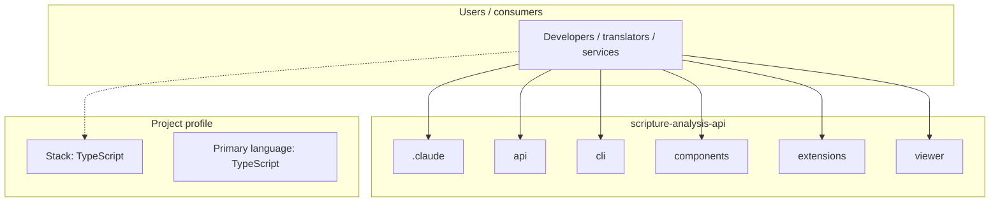
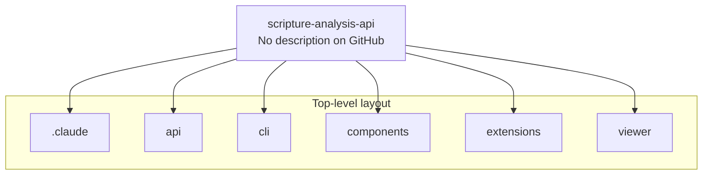
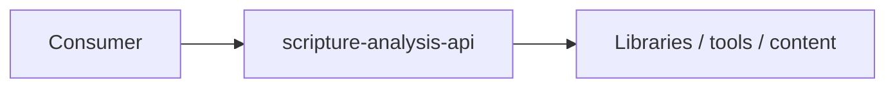

# scripture-analysis-api architecture

[WycliffeAssociates/scripture-analysis-api](https://github.com/WycliffeAssociates/scripture-analysis-api) — _no GitHub description_.

This API stores and serves AI-generated analysis of Bible translation projects. A translation project lives in a git repository as a collection of USFM files (one per book). Analysis runs against a specific commit and produces typed feedback items anchored to precise locations in the text, from the whole project down to individual characters. Multiple consumers — WYSIWYG editors, CI pipelines, reporting dashboards, scripture editors — query the same API.

## System context

## Repository structure

**Directories:** `.claude`, `api`, `cli`, `components`, `extensions`, `viewer`

**Notable files:** `.gitattributes`, `.gitignore`, `pnpm-lock.yaml`, `pnpm-workspace.yaml`, `README.md`

## Runtime / integration sketch

> This diagram is inferred from repository layout, languages, and README. It is a starting map, not a full design review.

## Languages

| Language | Approx. file count |
|----------|-------------------|
| TypeScript | 28 files |
| JavaScript | 8 files |
| YAML | 7 files |
| CSS | 3 files |
| SQL | 2 files |
| Shell | 2 files |
| HTML | 2 files |

## Design notes

| Topic | Detail |
|--------|--------|
| **Stack** | TypeScript |
| **Default branch** | `main` |
| **Org** | WycliffeAssociates |

## Related

- Source: [WycliffeAssociates/scripture-analysis-api](https://github.com/WycliffeAssociates/scripture-analysis-api)
- Branch analyzed: `main`
