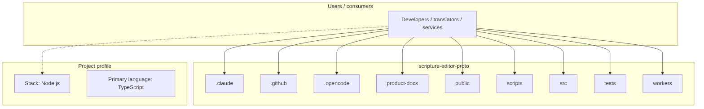
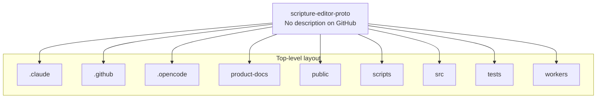
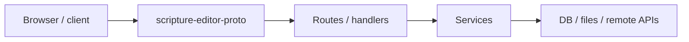

# scripture-editor-proto architecture

[WycliffeAssociates/scripture-editor-proto](https://github.com/WycliffeAssociates/scripture-editor-proto) — _no GitHub description_.

A scripture editing application built with Tauri, React, and TypeScript in Vite.

## System context

## Repository structure

**Directories:** `.claude`, `.github`, `.opencode`, `product-docs`, `public`, `scripts`, `src`, `tests`, `workers`

**Notable files:** `.browserslistrc`, `.env.example`, `.gitignore`, `.oxfmtrc.json`, `.oxlintrc.json`, `AGENTS.MD`, `index.html`, `knip.json`, `lefthook.yml`, `lingui.config.js`, `package.json`, `playwright.config.ts`, `pnpm-lock.yaml`, `pnpm-workspace.yaml`, `postcss.config.cjs`, `PRODUCT.md`, `README.md`, `tsconfig.json`, `tsconfig.node.json`, `vite.tauri.config.ts`

## Runtime / integration sketch

> This diagram is inferred from repository layout, languages, and README. It is a starting map, not a full design review.

## Languages

| Language | Approx. file count |
|----------|-------------------|
| TypeScript | 727 files |
| XML | 11 files |
| Rust | 10 files |
| YAML | 7 files |
| Kotlin | 6 files |
| HTML | 4 files |
| JavaScript | 2 files |
| CSS | 1 files |

## Design notes

| Topic | Detail |
|--------|--------|
| **Stack** | Node.js |
| **Default branch** | `master` |
| **Org** | WycliffeAssociates |

## Related

- Source: [WycliffeAssociates/scripture-editor-proto](https://github.com/WycliffeAssociates/scripture-editor-proto)
- Branch analyzed: `master`
