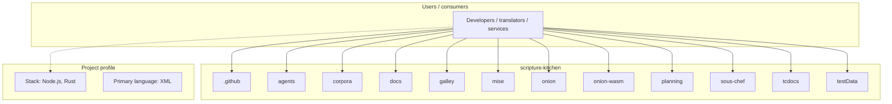
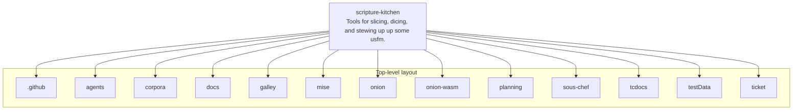
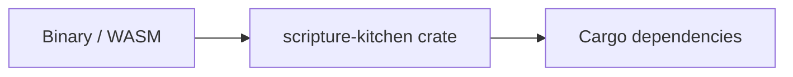

# scripture-kitchen architecture

[WycliffeAssociates/scripture-kitchen](https://github.com/WycliffeAssociates/scripture-kitchen) — Tools for slicing, dicing, and stewing up up some usfm..

A USFM engine in Rust: lex, CST, lint, format, and the USJ / USX / HTML exports, plus a JS doorway over the same code.

## System context

## Repository structure

**Directories:** `.github`, `agents`, `corpora`, `docs`, `galley`, `mise`, `onion`, `onion-wasm`, `planning`, `sous-chef`, `tcdocs`, `testData`, `ticket`

**Notable files:** `.gitignore`, `.mbx.toml`, `Cargo.lock`, `Cargo.toml`, `CLAUDE.md`, `clippy.toml`, `GLOSSARY.md`, `package-root.mjs`, `package.json`, `README.md`, `rust-toolchain.toml`, `wasm-build.sh`

## Runtime / integration sketch

> This diagram is inferred from repository layout, languages, and README. It is a starting map, not a full design review.

## Languages

| Language | Approx. file count |
|----------|-------------------|
| XML | 522 files |
| Rust | 234 files |
| TypeScript | 15 files |
| JavaScript | 6 files |
| YAML | 6 files |
| Shell | 4 files |
| HTML | 2 files |
| Python | 2 files |

## Design notes

| Topic | Detail |
|--------|--------|
| **Stack** | Node.js, Rust |
| **Default branch** | `master` |
| **Org** | WycliffeAssociates |

## Related

- Source: [WycliffeAssociates/scripture-kitchen](https://github.com/WycliffeAssociates/scripture-kitchen)
- Branch analyzed: `master`
