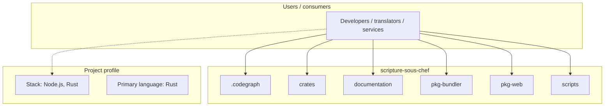
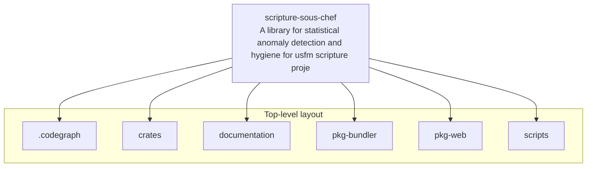
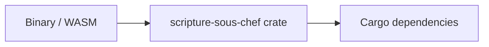

# scripture-sous-chef architecture

[WycliffeAssociates/scripture-sous-chef](https://github.com/WycliffeAssociates/scripture-sous-chef) — A library for statistical anomaly detection and hygiene for usfm scripture projects..

A pure, addressable **content analyzer** for scripture text. It receives the plain text of each verse and returns **ranges** — spellcheck-style findings ("there are two spaces here," control characters, …) — that an editor can resolve to highlights. Aimed at field Bible translators working in low-resource majority-world languages.

## System context

## Repository structure

**Directories:** `.codegraph`, `crates`, `documentation`, `pkg-bundler`, `pkg-web`, `scripts`

**Notable files:** `.DS_Store`, `.gitignore`, `Cargo.lock`, `Cargo.toml`, `package.json`, `README.md`

## Runtime / integration sketch

> This diagram is inferred from repository layout, languages, and README. It is a starting map, not a full design review.

## Languages

| Language | Approx. file count |
|----------|-------------------|
| Rust | 20 files |
| TypeScript | 4 files |
| JavaScript | 3 files |

## Design notes

| Topic | Detail |
|--------|--------|
| **Stack** | Node.js, Rust |
| **Default branch** | `master` |
| **Org** | WycliffeAssociates |

## Related

- Source: [WycliffeAssociates/scripture-sous-chef](https://github.com/WycliffeAssociates/scripture-sous-chef)
- Branch analyzed: `master`
