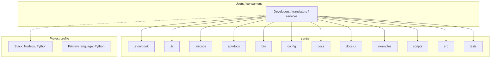
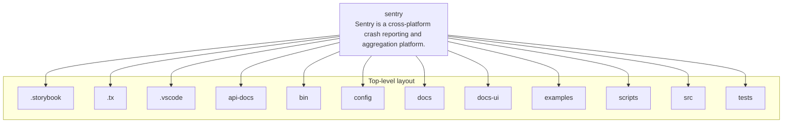
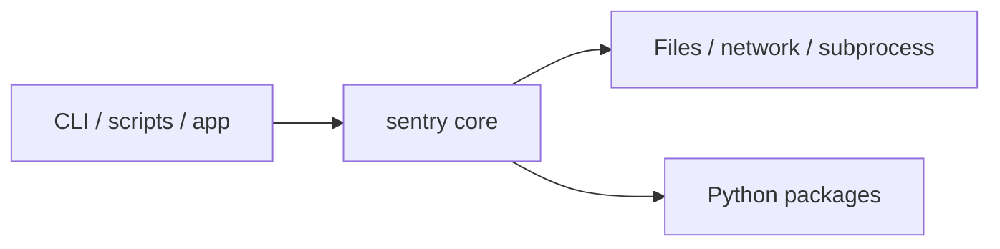

# sentry architecture

[WycliffeAssociates/sentry](https://github.com/WycliffeAssociates/sentry) — Sentry is a cross-platform crash reporting and aggregation platform..

Sentry is a cross-platform crash reporting and aggregation platform.

## System context

## Repository structure

**Directories:** `.storybook`, `.tx`, `.vscode`, `api-docs`, `bin`, `config`, `docs`, `docs-ui`, `examples`, `scripts`, `src`, `tests`

**Notable files:** `.babelrc`, `.coveragerc`, `.dockerignore`, `.eslintignore`, `.eslintrc`, `.gitattributes`, `.gitignore`, `.gitmodules`, `.isort.cfg`, `.mailmap`, `.nvmrc`, `.prettierrc`, `.travis.yml`, `AUTHORS`, `Brewfile`, `CHANGES`, `codecov.yml`, `conftest.py`, `CONTRIBUTING.md`, `Dangerfile`

## Runtime / integration sketch

> This diagram is inferred from repository layout, languages, and README. It is a starting map, not a full design review.

## Languages

| Language | Approx. file count |
|----------|-------------------|
| Python | 2,032 files |
| JavaScript | 871 files |
| HTML | 164 files |
| CSS | 4 files |
| XML | 4 files |
| YAML | 1 files |
| Batch | 1 files |
| Shell | 1 files |

## Design notes

| Topic | Detail |
|--------|--------|
| **Stack** | Node.js, Python |
| **Default branch** | `master` |
| **Org** | WycliffeAssociates |

## Related

- Source: [WycliffeAssociates/sentry](https://github.com/WycliffeAssociates/sentry)
- Branch analyzed: `master`
