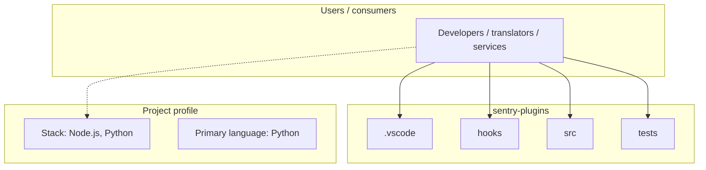
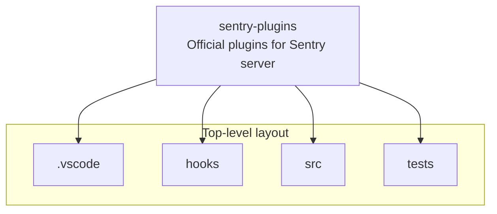
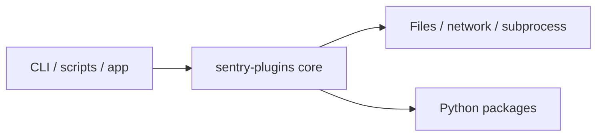

# sentry-plugins architecture

[WycliffeAssociates/sentry-plugins](https://github.com/WycliffeAssociates/sentry-plugins) — Official plugins for Sentry server.

Official plugins for Sentry server

## System context

## Repository structure

**Directories:** `.vscode`, `hooks`, `src`, `tests`

**Notable files:** `.babelrc`, `.gitattributes`, `.gitignore`, `.travis.yml`, `CHANGES`, `codecov.yml`, `conftest.py`, `Dangerfile`, `Gemfile`, `LICENSE`, `Makefile`, `MANIFEST.in`, `package.json`, `README.rst`, `setup.cfg`, `setup.py`, `webpack.config.js`, `yarn.lock`

## Runtime / integration sketch

> This diagram is inferred from repository layout, languages, and README. It is a starting map, not a full design review.

## Languages

| Language | Approx. file count |
|----------|-------------------|
| Python | 155 files |
| HTML | 13 files |
| JavaScript | 10 files |
| YAML | 1 files |
| CSS | 1 files |

## Design notes

| Topic | Detail |
|--------|--------|
| **Stack** | Node.js, Python |
| **Default branch** | `master` |
| **Org** | WycliffeAssociates |

## Related

- Source: [WycliffeAssociates/sentry-plugins](https://github.com/WycliffeAssociates/sentry-plugins)
- Branch analyzed: `master`
