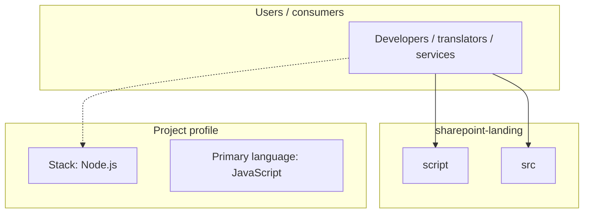
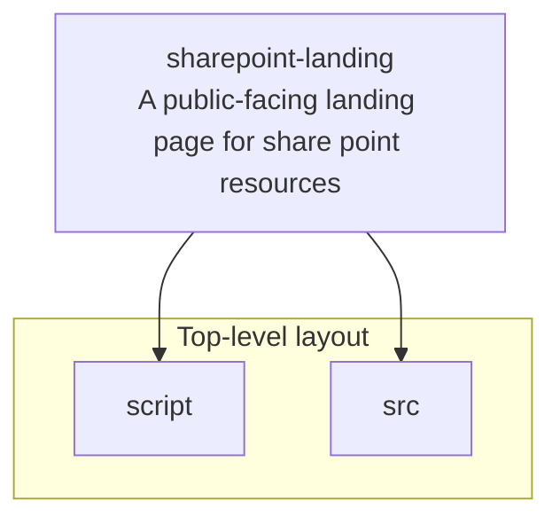
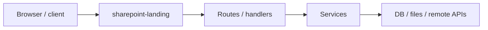

# sharepoint-landing architecture

[WycliffeAssociates/sharepoint-landing](https://github.com/WycliffeAssociates/sharepoint-landing) — A public-facing landing page for share point resources.

This is a very basic single-page, static site generator for SharePoint landing page.

## System context

## Repository structure

**Directories:** `script`, `src`

**Notable files:** `.gitignore`, `gulpfile.js`, `package-lock.json`, `package.json`, `README.md`

## Runtime / integration sketch

> This diagram is inferred from repository layout, languages, and README. It is a starting map, not a full design review.

## Languages

| Language | Approx. file count |
|----------|-------------------|
| JavaScript | 2 files |
| CSS | 1 files |

## Design notes

| Topic | Detail |
|--------|--------|
| **Stack** | Node.js |
| **Default branch** | `master` |
| **Org** | WycliffeAssociates |

## Related

- Source: [WycliffeAssociates/sharepoint-landing](https://github.com/WycliffeAssociates/sharepoint-landing)
- Branch analyzed: `master`
