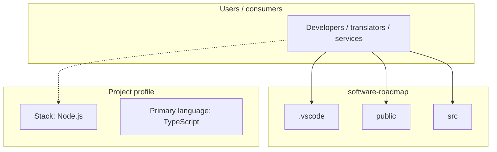
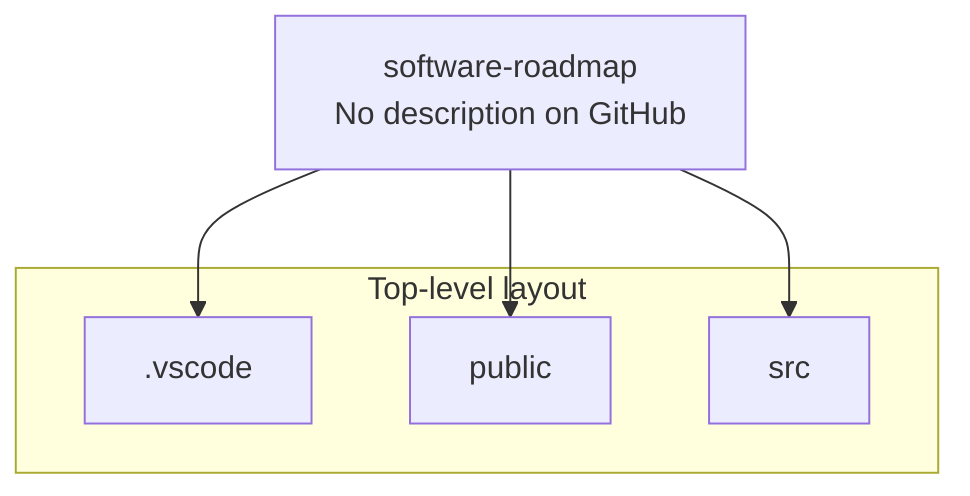
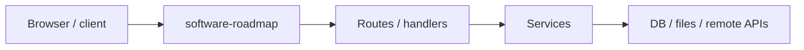

# software-roadmap architecture

[WycliffeAssociates/software-roadmap](https://github.com/WycliffeAssociates/software-roadmap) — _no GitHub description_.

todo:

## System context

## Repository structure

**Directories:** `.vscode`, `public`, `src`

**Notable files:** `.gitignore`, `astro.config.mjs`, `package.json`, `pnpm-lock.yaml`, `pnpm-workspace.yaml`, `README.md`, `tsconfig.json`, `worker-configuration.d.ts`, `wrangler.jsonc`

## Runtime / integration sketch

> This diagram is inferred from repository layout, languages, and README. It is a starting map, not a full design review.

## Languages

| Language | Approx. file count |
|----------|-------------------|
| TypeScript | 20 files |
| YAML | 2 files |
| CSS | 1 files |

## Design notes

| Topic | Detail |
|--------|--------|
| **Stack** | Node.js |
| **Default branch** | `master` |
| **Org** | WycliffeAssociates |

## Related

- Source: [WycliffeAssociates/software-roadmap](https://github.com/WycliffeAssociates/software-roadmap)
- Branch analyzed: `master`
