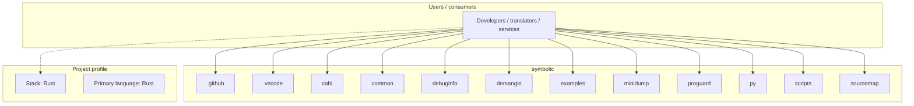
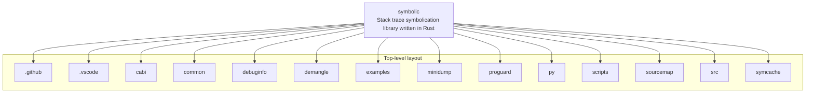

# symbolic architecture

[WycliffeAssociates/symbolic](https://github.com/WycliffeAssociates/symbolic) — Stack trace symbolication library written in Rust.

Symbolic is a library written in Rust which is used at [Sentry](https://sentry.io/) to implement symbolication of native stack traces, sourcemap handling for minified JavaScript and more. It consists of multiple largely independent crates which are bundled together into a C and Python library so it can be used independently of Rust.

## System context

## Repository structure

**Directories:** `.github`, `.vscode`, `cabi`, `common`, `debuginfo`, `demangle`, `examples`, `minidump`, `proguard`, `py`, `scripts`, `sourcemap`, `src`, `symcache`

**Notable files:** `.clang-format`, `.editorconfig`, `.gitattributes`, `.gitignore`, `.gitmodules`, `.travis.yml`, `Cargo.toml`, `LICENSE`, `Makefile`, `README.md`

## Runtime / integration sketch

> This diagram is inferred from repository layout, languages, and README. It is a starting map, not a full design review.

## Languages

| Language | Approx. file count |
|----------|-------------------|
| Rust | 51 files |
| C | 31 files |
| Python | 21 files |
| JavaScript | 19 files |
| C++ | 14 files |
| Shell | 1 files |

## Design notes

| Topic | Detail |
|--------|--------|
| **Stack** | Rust |
| **Default branch** | `master` |
| **Org** | WycliffeAssociates |

## Related

- Source: [WycliffeAssociates/symbolic](https://github.com/WycliffeAssociates/symbolic)
- Branch analyzed: `master`
