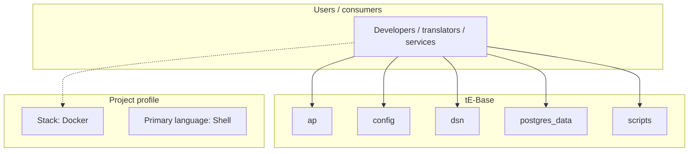
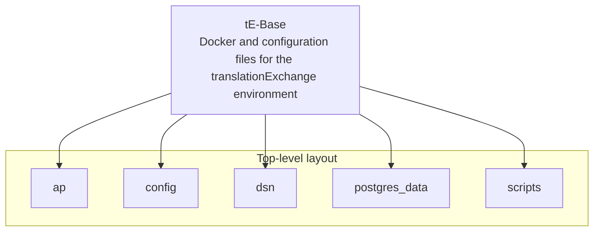
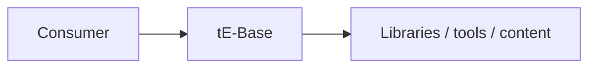

# tE-Base architecture

[WycliffeAssociates/tE-Base](https://github.com/WycliffeAssociates/tE-Base) — Docker and configuration files for the translationExchange environment.

moved to https://github.com/Bible-Translation-Tools/BTT-Exchanger

## System context

## Repository structure

**Directories:** `ap`, `config`, `dsn`, `postgres_data`, `scripts`

**Notable files:** `.gitignore`, `docker-compose.yml`, `Dockerfile`, `install_build.sh`, `LICENSE`, `README.md`, `restore_te_db.sh`

## Runtime / integration sketch

> This diagram is inferred from repository layout, languages, and README. It is a starting map, not a full design review.

## Languages

| Language | Approx. file count |
|----------|-------------------|
| Shell | 6 files |
| Python | 3 files |
| YAML | 1 files |

## Design notes

| Topic | Detail |
|--------|--------|
| **Stack** | Docker |
| **Default branch** | `master` |
| **Org** | WycliffeAssociates |

## Related

- Source: [WycliffeAssociates/tE-Base](https://github.com/WycliffeAssociates/tE-Base)
- Branch analyzed: `master`
